# Character Coherence Audit & Revision Template

## Hard Science Fiction - Character Database Analysis

**Character ID**: [CHAR-XXX]  
**Character Name**: **********\_**********  
**Audit Date**: **********\_**********  
**Audited By**: **********\_**********  
**Book/Chapter Range**: **********\_**********

---

## SECTION 1: BASIC INFORMATION AUDIT

### 1.1 Identity Coherence

**Database Entry Review**:

- **Full Name**: [From database]
- **Aliases/Titles**: [From database]
- **Pronunciation**: [From database]

**Story Usage Analysis**:
| Chapter | Name Used | Context | Matches Database? | Confusion Risk? | Issue |
|---------|-----------|---------|-------------------|-----------------|-------|
| [#] | [Name variant] | [Formal/Informal/Internal thought] | [Y/N] | [Y/N] | [Details] |

**Naming Consistency Check**:

```mermaid
graph TD
    A[Full Name:<br/>[Name]] --> B[Used in: Formal contexts]
    C[Alias: [Alias]] --> D[Used in: Casual contexts]
    E[Other name: [???]] -.->|Unexplained| F[INCONSISTENCY]

    style E fill:#FF6B6B
    style F fill:#FF0000
```

**Problems Found**:

1. **Unexplained Name Variants**:

   - Database has: [List names]
   - Story also uses: [Undocumented name]
   - Chapter: \_\_
   - **Issue**: [Reader confusion / Missing backstory]

2. **Inconsistent Name Usage**:

   - Formal name used in informal context (Chapter \_\_)
   - Nickname used in formal context (Chapter \_\_)
   - POV inconsistency (thinks of self as [X] but narrative uses [Y])

3. **Missing Pronunciation Guide**:
   - Name: [Complex/Unusual name]
   - No guide provided
   - **Risk**: [Readers may struggle]

**REVISION ACTIONS**:

- [ ] Add alias to database:
  - Alias: [Name]
  - Origin: [Why they're called this]
  - Used by: [Which characters/contexts]
- [ ] Standardize usage:
  - Formal contexts: Use [Name]
  - Informal contexts: Use [Name]
  - POV chapters: Use [Name]
  - Revise chapters: [List]
- [ ] Add pronunciation guide:
  - Name: [Complex name]
  - Pronunciation: [Phonetic spelling]
  - Introduce naturally in chapter: \_\_ [Character asks/explains]
- [ ] Remove confusing variant:
  - Delete from chapters: [List]
  - Replace with: [Consistent name]

---

## SECTION 2: ARCHETYPE & ROLE AUDIT

### 2.1 Archetype Coherence

**Database Entry**:

- **Primary Archetype**: [From database]
- **Secondary Archetypes**: [From database]
- **Role in Story**: [From database]
- **POV Status**: [From database]

**Archetype Behavior Verification**:
| Archetype Trait | Expected Behavior | Chapter | Actual Behavior | Match? | Issue |
|-----------------|-------------------|---------|-----------------|--------|-------|
| [Trait from archetype] | [Typical pattern] | [#] | [What character does] | [Y/N] | [Details] |

**Archetype Consistency Map**:

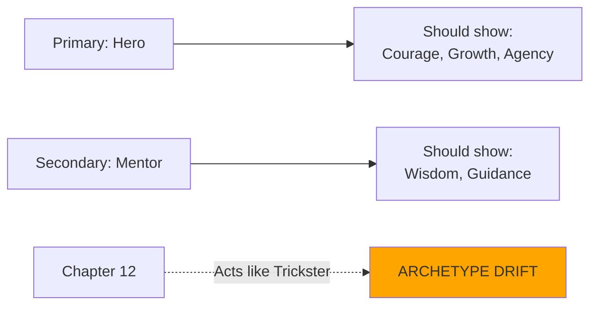

**Problems Found**:

1. **Archetype Drift**:

   - Database: [Primary archetype]
   - Chapter \_\_: Behaves like [Different archetype]
   - **Issue**: [Character feels inconsistent]

2. **Contradictory Archetypes**:

   - Primary: [Archetype A]
   - Secondary: [Archetype B]
   - **Conflict**: [How they contradict]
   - **Story impact**: [Confusion / Interesting tension]

3. **Archetype Not Demonstrated**:
   - Claims to be: [Archetype]
   - Never shows: [Key archetype trait]
   - **Issue**: [Unfulfilled promise]

**Role Verification**:
| Database Role | Story Function | Match? | Issue |
|---------------|----------------|--------|-------|
| [Protagonist/Antagonist/etc.] | [Actual story role] | [Y/N] | [Details] |

**POV Status Accuracy**:

- [ ] Database claims POV chapters: [List]
- [ ] Actual POV chapters: [List from story]
- [ ] Match?: [Y/N]
- [ ] Discrepancy: [Details]

**REVISION ACTIONS**:

- [ ] Update archetype:
  - Change from [Old] to [New]
  - Reason: [Story evolved]
  - Update database
- [ ] Add archetype demonstration:
  - Chapter \_\_: Show [Key archetype trait]
  - Scene: [Description]
- [ ] Resolve archetype conflict:
  - Make tension explicit: Chapter \_\_ [Character struggles with dual nature]
  - OR simplify: Remove [Secondary archetype] from database
- [ ] Correct role classification:
  - Update database to: [Actual role]
- [ ] Add/remove POV chapters:
  - Add POV: Chapter \_\_
  - Remove POV: Chapter \_\_ (shift to [Other character])
  - Update database

---

## SECTION 3: PHYSICAL DESCRIPTION AUDIT

### 3.1 Appearance Coherence

**Database Entry**:

- **Age**: [From database]
- **Gender**: [From database]
- **Appearance**: [From database]
- **Health Status**: [From database]

**Physical Description Consistency**:
| Feature | Database | Chapter | Story Description | Match? | Issue |
|---------|----------|---------|-------------------|--------|-------|
| Age | [Value] | [#] | [Described as] | [Y/N] | [Details] |
| Height | [Value] | [#] | [Described as] | [Y/N] | [Details] |
| Hair | [Value] | [#] | [Described as] | [Y/N] | [Details] |
| Eyes | [Value] | [#] | [Described as] | [Y/N] | [Details] |
| Build | [Value] | [#] | [Described as] | [Y/N] | [Details] |
| Distinguishing | [Value] | [#] | [Described as] | [Y/N] | [Details] |

**Age Consistency Check**:

```
First appearance (Ch __): [Age stated/implied]
Timeline progression: [Duration of story]
Current chapter (Ch __): [Age should be]
Actually described as: [Age in text]
Math checks out?: [Y/N]
```

**Health Status Verification**:
| Database Condition | Chapter | Physical Actions | Consistent? | Issue |
|--------------------|---------|------------------|-------------|-------|
| [Disability/Enhancement] | [#] | [What they do physically] | [Y/N] | [Details] |

**Problems Found**:

1. **Changing Appearance**:

   - Chapter \_\_: [Description A]
   - Chapter \_\_: [Description B]
   - **Issue**: [Contradictory details]

2. **Age Inconsistency**:

   - Database: [Age]
   - Story timeline: [Duration]
   - Should now be: [Calculated age]
   - Described as: [Wrong age]

3. **Forgotten Physical Limitation**:

   - Database: [Health condition]
   - Chapter \_\_: Character does [Impossible action]
   - **Issue**: [Breaks established limits]

4. **Underdeveloped Distinctive Features**:
   - Database: [Distinctive feature]
   - Mentioned only once in chapter: \_\_
   - Never referenced again
   - **Issue**: [Wasted detail]

**REVISION ACTIONS**:

- [ ] Standardize physical description:
  - Canonical appearance: [Description]
  - Update chapters: [List] to match
- [ ] Age progression tracking:
  - Add age markers: [Birthdays, time references]
  - Update database with current age
  - Ensure consistency in chapters: [List]
- [ ] Enforce physical limitations:
  - Chapter \_\_: Revise [Action] to respect [Limitation]
  - Add workaround: [Assistive tech, help from others]
- [ ] Enhance distinctive features:
  - Feature: [What makes them memorable]
  - Reference in chapters: [List] for consistency
  - Use in recognition scenes
- [ ] Remove contradictions:
  - Choose one description: [Selected version]
  - Delete alternative from chapter: \_\_

---

## SECTION 4: BACKGROUND & ORIGIN AUDIT

### 4.1 Biography Coherence

**Database Entry**:

- **Birthplace**: [From database]
- **Family**: [From database]
- **Education/Training**: [From database]
- **Occupation/Profession**: [From database]
- **Social Status**: [From database]

**Background Consistency Check**:
| Background Element | Database | Chapter | Story Reference | Match? | Issue |
|--------------------|----------|---------|-----------------|--------|-------|
| Birthplace | [Location] | [#] | [Mentioned as] | [Y/N] | [Details] |
| Family members | [List] | [#] | [Mentioned] | [Y/N] | [Details] |
| Education | [Details] | [#] | [Referenced] | [Y/N] | [Details] |
| Profession | [Title] | [#] | [Shown/stated] | [Y/N] | [Details] |

**Timeline Validation**:

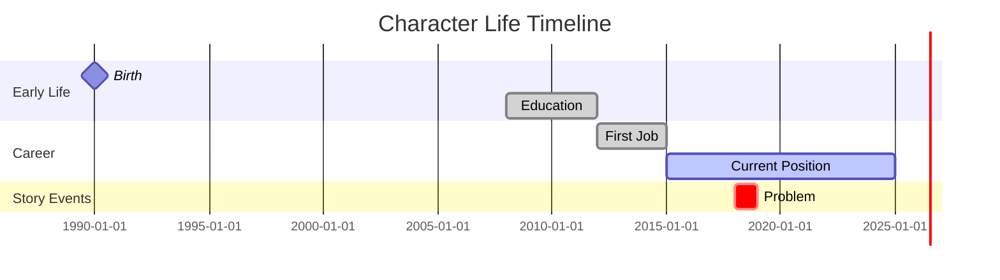

**Age-Experience Plausibility**:
| Achievement | Age When Occurred | Realistic? | Issue |
|-------------|-------------------|------------|-------|
| [Education/Position] | [Age] | [Y/N] | [Too young/old?] |

**Problems Found**:

1. **Biographical Contradiction**:

   - Database: [Fact A]
   - Chapter \_\_: States [Contradictory fact B]
   - **Issue**: [Canon confusion]

2. **Implausible Timeline**:

   - Character age: [X]
   - Education claimed: [PhD + 10 years experience]
   - **Math**: [Doesn't add up - too young]

3. **Ghost Family Members**:

   - Database: Has [Sibling/Parent]
   - Never mentioned in story
   - **Issue**: [Incomplete backstory]

4. **Occupation Mismatch**:

   - Database: [Profession A]
   - Story shows: Does job of [Profession B]
   - **Issue**: [Career unclear]

5. **Social Status Inconsistency**:
   - Database: [Low status]
   - Chapter \_\_: Has access/privileges of [High status]
   - **Issue**: [Unexplained mobility]

**REVISION ACTIONS**:

- [ ] Resolve biographical contradiction:
  - Canon version: [Choose which is true]
  - Update database OR revise chapter: \_\_
  - Explain discrepancy if intentional: [Reason]
- [ ] Fix timeline:
  - Adjust age to: [Realistic age]
  - OR reduce achievements to match age
  - Update database
- [ ] Address family members:
  - Add mention in chapter: \_\_ [Brief reference]
  - OR remove from database [If not relevant]
  - Explain absence if important: [Reason]
- [ ] Clarify occupation:
  - Primary profession: [Choose one]
  - Update database and chapters: [List]
- [ ] Justify social status:
  - Add explanation: [How they got access]
  - Chapter \_\_: [Scene showing status]
  - OR adjust status in database

---

## SECTION 5: PERSONALITY & PSYCHOLOGY AUDIT

### 5.1 Personality Trait Coherence

**Database Entry**:

- **Core Personality Traits**: [From database]
- **Strengths**: [From database]
- **Flaws/Weaknesses**: [From database]
- **Motivations**: [From database]
- **Fears**: [From database]
- **Values/Beliefs**: [From database]

**Trait Manifestation Tracking**:
| Trait | Chapter | Situation | Behavior Shown | Matches Trait? | Issue |
|-------|---------|-----------|----------------|----------------|-------|
| [Trait 1] | [#] | [Context] | [Action/dialogue] | [Y/N] | [Details] |
| [Trait 2] | [#] | [Context] | [Action/dialogue] | [Y/N] | [Details] |

**Behavioral Consistency Analysis**:

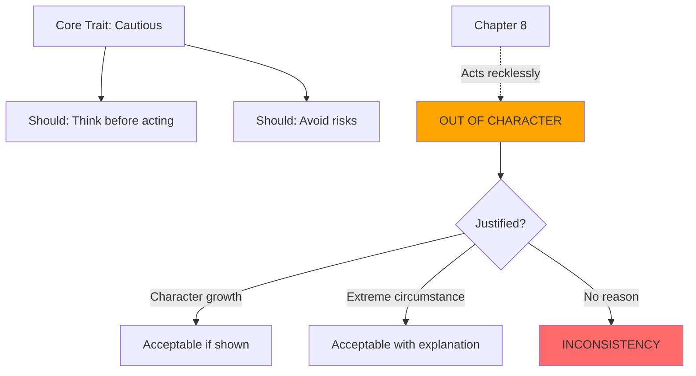

**Motivation Consistency**:
| Database Motivation | Chapter | Decision/Action | Aligns? | Issue |
|---------------------|---------|-----------------|---------|-------|
| [Motivation] | [#] | [What they do] | [Y/N] | [Details] |

**Fear Demonstration**:

- [ ] Stated fear: [Fear from database]
- [ ] Demonstrated in chapters: [List where fear shown]
- [ ] Character confronts fear?: [Y/N - Chapter __]
- [ ] Fear impacts decisions?: [Y/N - Examples]

**Values Consistency**:
| Core Value | Chapter | Moral Choice | Consistent? | Issue |
|------------|---------|--------------|-------------|-------|
| [Value] | [#] | [Decision made] | [Y/N] | [Details] |

**Problems Found**:

1. **Out of Character Behavior**:

   - Trait: [Personality trait]
   - Chapter \_\_: [Contradictory action]
   - **Issue**: [No explanation for change]

2. **Unexpressed Motivation**:

   - Database: Motivated by [X]
   - Story: Never pursues [X]
   - **Issue**: [Stated motivation not demonstrated]

3. **Forgotten Fear**:

   - Database: Fears [X]
   - Chapter \_\_: Faces [X] without reaction
   - **Issue**: [Psychological inconsistency]

4. **Values Violation**:

   - Database: Values [Honesty]
   - Chapter \_\_: Lies without conflict
   - **Issue**: [Character compromise not addressed]

5. **Contradictory Traits**:
   - Strength: [X]
   - Flaw: [Opposite of X]
   - **Issue**: [Needs nuance or is impossible]

**REVISION ACTIONS**:

- [ ] Add explanation for OOC moment:
  - Chapter \_\_: Add internal monologue explaining [Why acting differently]
  - Justification: [Extreme pressure / Character growth / Desperate situation]
- [ ] Demonstrate motivation:
  - Chapter \_\_: Add scene showing pursuit of [Goal]
  - Dialogue: Character states desire for [Motivation]
- [ ] Show fear response:
  - Chapter \_\_: Add [Physical/emotional reaction] when facing [Fear]
  - Impact: [How fear affects decision]
- [ ] Add moral conflict:
  - Chapter \_\_: Character struggles with violating [Value]
  - Resolution: [How they justify or suffer consequence]
- [ ] Revise database:
  - Update traits to match story behavior
  - New trait: [What story actually shows]
  - Remove inconsistent trait: [Which one]
- [ ] Rewrite scene:
  - Chapter \_\_: Change [Action] to align with [Trait]

---

## SECTION 6: EXPERTISE & SKILLS AUDIT

### 6.1 Knowledge Domain Coherence

**Database Entry**:

- **Technical Expertise**: [From database]
- **Knowledge Domains**: [From database]
- **Skills**: [From database]
- **Inexperience/Ignorance**: [From database]

**Expertise Demonstration Matrix**:
| Claimed Expertise | Chapter | Demonstration | Competence Level Shown | Match? | Issue |
|-------------------|---------|---------------|------------------------|--------|-------|
| [Domain] | [#] | [How used] | [Novice/Competent/Expert] | [Y/N] | [Details] |

**Hard SF Plausibility Check**:

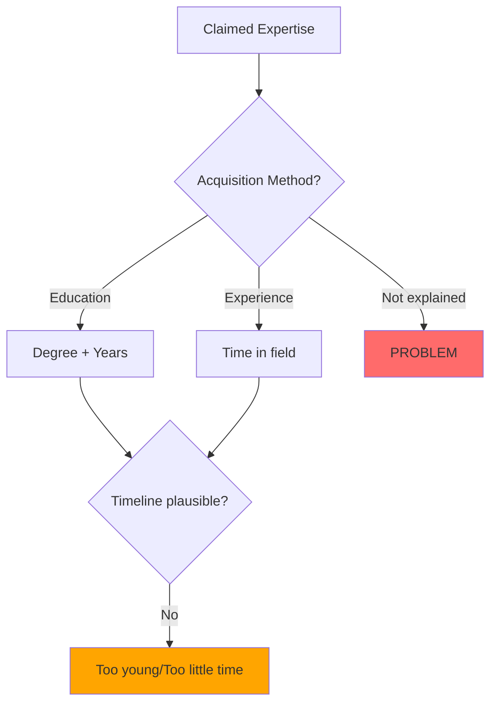

**Knowledge Application Verification**:
| Situation | Expertise Needed | Character Has? | Uses Appropriately? | Issue |
|-----------|------------------|----------------|---------------------|-------|
| [Problem in Ch __] | [Domain] | [Y/N] | [Y/N] | [Details] |

**Ignorance Consistency**:

- [ ] Database states ignorant of: [Topic]
- [ ] Chapter \_\_: Character demonstrates knowledge of [Topic]
- [ ] **Violation**: [Y/N]
- [ ] **Explanation**: [Learning shown / Error]

**Problems Found**:

1. **Omniscient Expert**:

   - Character knows: [Too many domains]
   - Age/experience: [Insufficient for this breadth]
   - **Issue**: [Renaissance polymath problem in Hard SF]

2. **Unexplained Competence**:

   - Chapter \_\_: Uses [Technical skill]
   - Database: No listed expertise in [Field]
   - **Issue**: [Where did this come from?]

3. **Forgotten Limitation**:

   - Database: Inexperienced in [Domain]
   - Chapter \_\_: Performs expertly
   - No learning shown between
   - **Issue**: [Skill appeared magically]

4. **Inconsistent Expertise Level**:
   - Chapter 5: Struggles with [Basic task]
   - Chapter 10: Masters [Advanced task] in same domain
   - **Issue**: [Uneven competence]

**REVISION ACTIONS**:

- [ ] Reduce expertise scope:
  - Remove from database: [Domains character doesn't need]
  - Redistribute to other characters: [Who should know this]
  - Revise chapters: [Where character acts too knowledgeable]
- [ ] Add expertise to database:
  - New domain: [Field shown in story]
  - Acquisition: [Education/Experience]
  - Update character background section
- [ ] Add learning arc:
  - Chapter \_\_ (start): Character doesn't know [X]
  - Chapter \_\_ (middle): [Training/Study scene]
  - Chapter \_\_ (end): Character competent in [X]
- [ ] Show collaboration:
  - Chapter \_\_: Character consults [[CHAR-expert]] about [Topic]
  - Removes omniscience, adds realism
- [ ] Standardize competence level:
  - Choose level: [Novice/Intermediate/Expert]
  - Adjust all scenes to match
  - Chapters to revise: [List]

---

## SECTION 7: CHARACTER ARC AUDIT

### 7.1 Arc Progression Coherence

**Database Entry**:

- **Starting State**: [From database]
- **Key Milestones**: [From database]
- **Transformation Points**: [From database]
- **Ending State**: [From database]
- **Arc Satisfaction**: [From database]

**Arc Progression Map**:

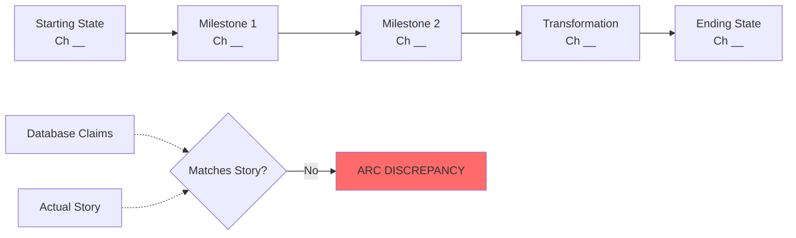

**Milestone Verification**:
| Database Milestone | Expected Chapter | Actual Chapter | Event Description | Match? | Issue |
|--------------------|------------------|----------------|-------------------|--------|-------|
| [Milestone] | [Ch from DB] | [Ch in story] | [What happens] | [Y/N] | [Details] |

**Transformation Justification**:
| Transformation | Chapter | Catalyst | Believable? | Earned? | Issue |
|----------------|---------|----------|-------------|---------|-------|
| [Change] | [#] | [What causes it] | [Y/N] | [Y/N] | [Details] |

**State Consistency Check**:

```
Starting State (Database): [Description]
Starting State (Chapter __): [Actual]
Match?: [Y/N]

Ending State (Database): [Description]
Ending State (Chapter __): [Actual]
Match?: [Y/N]
```

**Problems Found**:

1. **Missing Arc**:

   - Database: [Complex arc described]
   - Story: Character basically same at end
   - **Issue**: [Static character despite plan]

2. **Unearned Transformation**:

   - Chapter \_\_: Character suddenly [Changed]
   - No catalyst shown
   - **Issue**: [Change feels arbitrary]

3. **Regression Without Explanation**:

   - Milestone achieved: Chapter \_\_
   - Chapter \_\_: Character back to old behavior
   - **Issue**: [Arc seems undone]

4. **Misplaced Milestones**:

   - Database says: Milestone in Chapter X
   - Actually occurs: Chapter Y (much earlier/later)
   - **Issue**: [Database out of sync]

5. **Insufficient Arc Satisfaction**:
   - Database claims: [Satisfying resolution]
   - Reader likely feels: [Incomplete/Abrupt]
   - **Issue**: [Arc needs more development]

**REVISION ACTIONS**:

- [ ] Update database milestones:
  - Correct chapters: [List actual chapters]
  - Update milestone descriptions to match story
- [ ] Add missing transformation:
  - Chapter \_\_: [Scene showing change]
  - Catalyst: [Event that triggers growth]
  - Internal monologue: [Character realizes change]
- [ ] Build up to transformation:
  - Chapter \_\_ (earlier): Plant seeds [Doubt/Question]
  - Chapter \_\_ (middle): [Pressure builds]
  - Chapter \_\_ (transformation): [Change feels earned]
- [ ] Justify regression:
  - Add reason: [Why character backslides]
  - Makes arc: [Spiral pattern, not linear]
  - Eventually resolves: Chapter \_\_
- [ ] Extend arc:
  - Add chapters/scenes: [Where]
  - Additional milestones: [What]
  - Deeper resolution: [How]
- [ ] Simplify arc:
  - Database is too ambitious: Remove [Complexity]
  - Match actual story: [Simpler but complete arc]

---

## SECTION 8: RELATIONSHIPS AUDIT

### 8.1 Relationship Coherence

**Database Entry**:

- **Primary Relationships**: [From database]
- **Secondary Relationships**: [From database]
- **Antagonistic Relationships**: [From database]

**Relationship Status Verification**:
| Other Character | Database Relationship | Chapter | Story Shows | Match? | Issue |
|-----------------|----------------------|---------|-------------|--------|-------|
| [[CHAR-xxx]] | [Type/status] | [#] | [Actual dynamic] | [Y/N] | [Details] |

**Relationship Evolution Tracking**:

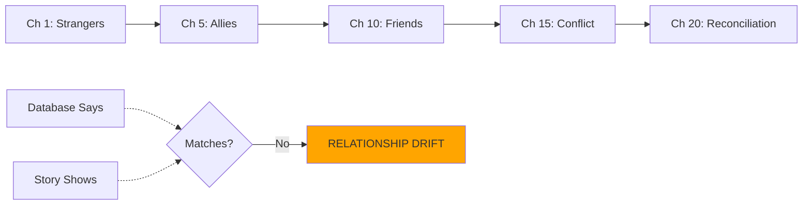

**Relationship Development Milestones**:
| Relationship | Database Milestone | Chapter | Actually Occurs? | Quality | Issue |
|--------------|-------------------|---------|------------------|---------|-------|
| With [[CHAR-xxx]] | [Event] | [#] | [Y/N - Description] | [Rating] | [Notes] |

**Interaction Frequency Check**:

- [ ] Database: [Character A] & [Character B] are [Close/Important relationship]
- [ ] Scenes together: [Count] in chapters: [List]
- [ ] **Assessment**: [Sufficient / Insufficient for claimed closeness]

**Problems Found**:

1. **Ghost Relationship**:

   - Database: [Character X] is [Important relationship]
   - Story: They interact [Never/Once/Minimally]
   - **Issue**: [Claimed importance not demonstrated]

2. **Contradictory Dynamics**:

   - Database: [Friendly/Hostile]
   - Chapter \_\_: Opposite dynamic shown
   - **Issue**: [Relationship unclear]

3. **Unmotivated Shift**:

   - Chapter \_\_: [Relationship status A]
   - Chapter \_\_: [Relationship status B]
   - No event explains change
   - **Issue**: [Sudden unexplained shift]

4. **Missing Antagonist**:

   - Database: Antagonistic with [[CHAR-xxx]]
   - Story: No conflict shown
   - **Issue**: [Wasted dramatic potential]

5. **Relationship Imbalance**:
   - Character A views B as: [X]
   - Character B views A as: [Y]
   - Imbalance never acknowledged
   - **Issue**: [Unexplored tension]

**REVISION ACTIONS**:

- [ ] Add relationship scenes:
  - Characters: [A] & [B]
  - Chapter \_\_: [Scene establishing relationship]
  - Chapter \_\_: [Scene developing relationship]
  - Chapter \_\_: [Scene testing relationship]
- [ ] Update database:
  - Actual relationship: [What story shows]
  - Remove relationship: [If not in story]
  - Downgrade to secondary: [If minimal interaction]
- [ ] Add transition scene:
  - Chapter \_\_: Event that shifts relationship from [X] to [Y]
  - Catalyst: [What causes change]
  - Both characters react: [Show perspectives]
- [ ] Create conflict:
  - Chapter \_\_: Antagonistic relationship manifests
  - Source: [What they fight about]
  - Resolution/escalation: Chapter \_\_
- [ ] Address imbalance:
  - Chapter \_\_: Characters discuss different perceptions
  - OR maintain tension: Use asymmetry for drama
- [ ] Remove relationship:
  - Delete from database: [Which one]
  - Reason: [Not supported by story]

---

## SECTION 9: STORY INTEGRATION AUDIT

### 9.1 Presence & Impact Verification

**Database Entry**:

- **First Appearance**: [From database]
- **Chapter Appearances**: [From database]
- **POV Chapters**: [From database]
- **Key Scenes**: [From database]

**Actual Appearance Tracking**:
| Database Claims | Story Reality | Match? | Issue |
|-----------------|---------------|--------|-------|
| First: Ch ** | Actually: Ch ** | [Y/N] | [Details] |
| Appears in: [List] | Actually in: [List] | [Y/N] | [Details] |
| POV: [List] | Actually POV: [List] | [Y/N] | [Details] |

**Presence Heatmap**:

```mermaid
gantt
    title Character Presence Across Story
    dateFormat X
    axisFormat %s

    section Presence
    Chapters 1-5 :0, 5
    Absent :5, 8
    Chapters 9-15 :8, 15
    Absent :15, 18
    Chapters 19-25 :18, 25
```

**Absence Analysis**:

- **Long absences**: Chapters [__] through [__] ([Duration])
- **Problem?**: [Too long for [Primary/Secondary] character / Acceptable]
- **Explanation in story**: [Y/N - How addressed]

**Key Scene Verification**:
| Database Key Scene | Chapter | Actually Happens? | Impact | Quality | Issue |
|--------------------|---------|-------------------|--------|---------|-------|
| [Scene] | [#] | [Y/N] | [High/Med/Low] | [Rating] | [Notes] |

**Problems Found**:

1. **Database Out of Sync**:

   - First appearance wrong by [X] chapters
   - Appearance list missing chapters: [List]
   - **Issue**: [Database doesn't reflect story]

2. **Unexplained Absence**:

   - Important character gone for chapters [X-Y]
   - No explanation where they went
   - **Issue**: [Reader confusion]

3. **Missing Key Scene**:

   - Database promises: [Scene]
   - Never occurs in story
   - **Issue**: [Unfulfilled setup]

4. **Underdeveloped Presence**:
   - Character type: [Primary/POV]
   - Page time: [Minimal]
   - **Issue**: [Insufficient for role]

**REVISION ACTIONS**:

- [ ] Update database appearance list:
  - Correct first appearance: Chapter \_\_
  - Full chapter list: [Complete list]
  - POV chapters: [Actual list]
- [ ] Address absence:
  - Add line: Chapter \_\_ [Where they went]
  - OR add scene: Chapter \_\_ [Show what they're doing]
  - OR reduce absence: Add to chapters: [List]
- [ ] Add missing key scene:
  - Chapter \_\_: [Scene from database]
  - Purpose: [Why it matters]
- [ ] Increase presence:
  - Add to chapters: [List]
  - Scenes to add: [Brief descriptions]
- [ ] Remove key scene:
  - Delete from database: [Which scene]
  - Reason: [Cut from story / Never planned properly]

---

## SECTION 10: THEMATIC ROLE AUDIT

### 10.1 Thematic Coherence

**Database Entry**:

- **Themes Embodied**: [From database]
- **Symbolic Meaning**: [From database]
- **Narrative Function**: [From database]

**Theme Embodiment Verification**:
| Theme | How Character Embodies | Chapter | Evidence | Effective? | Issue |
|-------|------------------------|---------|----------|------------|-------|
| [Theme] | [Method from DB] | [#] | [Story example] | [Y/N] | [Details] |

**Symbolic Function Check**:

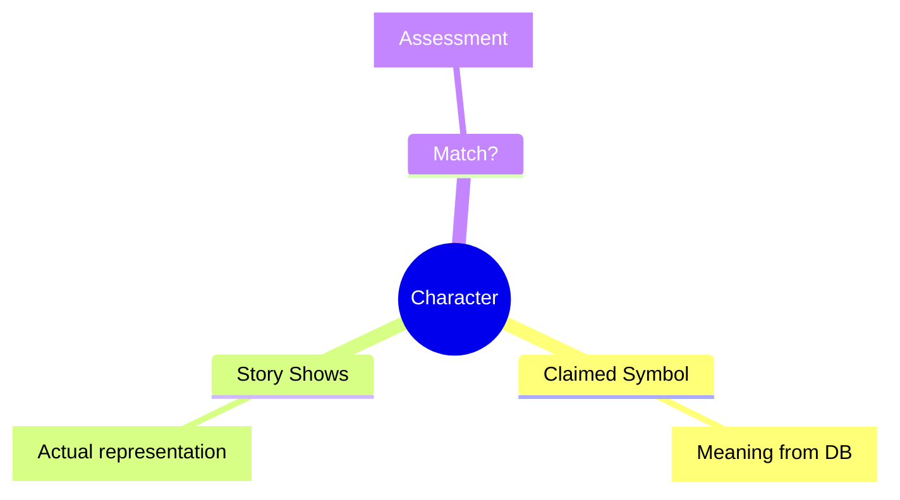

**Narrative Function Analysis**:

- [ ] Database claims function: [Function]
- [ ] Character actually serves: [Observed function]
- [ ] Match?: [Y/N]
- [ ] **Assessment**: [Working as intended / Needs adjustment]

**Problems Found**:

1. **Weak Thematic Connection**:

   - Database: Embodies [Theme]
   - Story: Barely explores this
   - **Issue**: [Unfulfilled thematic purpose]

2. **Contradictory Symbolism**:

   - Supposed to represent: [X]
   - Actually represents: [Opposite of X]
   - **Issue**: [Thematic confusion]

3. **Narrative Function Drift**:

   - Database: [Function A - e.g., Catalyst]
   - Story: Serves as [Function B - e.g., Comic Relief]
   - **Issue**: [Role unclear or changed]

4. **Unexplored Thematic Potential**:
   - Character positioned to explore [Theme]
   - Opportunity never taken
   - **Issue**: [Wasted setup]

**REVISION ACTIONS**:

- [ ] Strengthen thematic expression:
  - Chapter \_\_: Add scene/dialogue exploring [Theme]
  - Character explicitly faces: [Thematic question]
  - Resolution shows: [Thematic insight]
- [ ] Update database symbolism:
  - Change from: [Old meaning]
  - Change to: [What character actually represents]
- [ ] Clarify narrative function:
  - Decide: [What character's job is]
  - Update database
  - Ensure scenes support this function
- [ ] Add thematic exploration:
  - Chapter \_\_: [Scene addressing theme]
  - Character choice reveals: [Thematic stance]
- [ ] Remove thematic claim:
  - Delete from database: [Theme character doesn't serve]
  - Redistribute to: [[CHAR-xxx]] who better embodies it

---

## SECTION 11: PLOT INTEGRATION AUDIT

### 11.1 Plot Connection Verification

**Database Entry**:

- **Plot Threads Connected**: [From database]
- **Conflicts Driven**: [From database]
- **Resolutions Involved**: [From database]

**Plot Thread Connection Matrix**:
| Plot Thread | Database Connection | Chapter | Actually Connected? | How | Quality |
|-------------|---------------------|---------|-------------------|------|---------|
| [Thread] | [Type of connection] | [#] | [Y/N] | [Description] | [Rating] |

**Conflict Generation Check**:

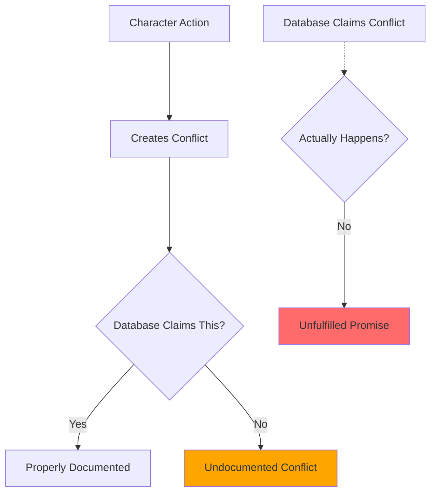

**Resolution Involvement Verification**:
| Resolution | Database Claims | Chapter | Character's Role | Appropriate? | Issue |
|------------|-----------------|---------|------------------|--------------|-------|
| [Plot resolution] | [Involvement level] | [#] | [What they do] | [Y/N] | [Details] |

**Problems Found**:

1. **Disconnected Character**:

   - Database: Connected to [Plot thread]
   - Story: Minimal actual connection
   - **Issue**: [Character feels tangential]

2. **Undocumented Impact**:

   - Character drives major conflict: [Description]
   - Not in database
   - **Issue**: [Database incomplete]

3. **Deus Ex Character**:

   - Character solves problem in chapter \_\_
   - No setup or earning
   - **Issue**: [Unearned resolution]

4. **Missing Payoff**:

   - Database: Character resolves [X]
   - Story: Never happens
   - **Issue**: [Abandoned plot thread]

5. **Wrong Character Solving**:
   - Should be protagonist's challenge
   - This character solves it instead
   - **Issue**: [Steals agency from main character]

**REVISION ACTIONS**:

- [ ] Add plot connection:
  - Chapter \_\_: Character becomes involved in [Thread]
  - Connection type: [How they're tied in]
  - Update database
- [ ] Document actual conflicts:
  - Add to database: [Conflict character creates]
  - Chapters involved: [List]
- [ ] Set up resolution:
  - Chapter \_\_ (early): Establish [Skill/Knowledge/Item]
  - Chapter \_\_ (middle): Demonstrate capability
  - Chapter \_\_ (late): Use to resolve conflict
- [ ] Add missing resolution:
  - Chapter \_\_: Character resolves [Plot thread]
  - Method: [How they do it]
- [ ] Remove resolution:
  - Give to: [[CHAR-protagonist]]
  - This character supports instead
  - Revise chapter: \_\_
- [ ] Update database:
  - Actual plot threads: [List]
  - Actual conflicts: [List]
  - Actual resolutions: [List]

---

## SECTION 12: VOICE & COMMUNICATION AUDIT

### 12.1 Speech Pattern Coherence

**Database Entry**:

- **Speech Patterns**: [From database]
- **Communication Style**: [From database]
- **Language/Accent**: [From database]

**Dialogue Consistency Check**:
| Claimed Pattern | Chapter | Dialogue Sample | Matches? | Issue |
|-----------------|---------|-----------------|----------|-------|
| [Pattern from DB] | [#] | [Actual quote] | [Y/N] | [Details] |

**Voice Distinctiveness Test**:

```
Sample 1 (Ch __): "[Dialogue line]"
Sample 2 (Ch __): "[Dialogue line]"
Sample 3 (Ch __): "[Dialogue line]"

Consistent voice?: [Y/N]
Distinguishable from other characters?: [Y/N]
Matches database description?: [Y/N]
```

**Communication Style Verification**:
| Database Style | Chapter | Actual Style | Match? | Issue |
|----------------|---------|--------------|--------|-------|
| [Direct/Verbose/etc.] | [#] | [Observed] | [Y/N] | [Details] |

**Problems Found**:

1. **Generic Voice**:

   - Sounds like every other character
   - No distinctive patterns
   - **Issue**: [Character not differentiated]

2. **Inconsistent Speech**:

   - Chapter \_\_: [Speech pattern A]
   - Chapter \_\_: [Speech pattern B]
   - **Issue**: [Voice drift]

3. **Contradictory Style**:

   - Database: [Verbose]
   - Story: Uses short, clipped sentences
   - **Issue**: [Mismatch]

4. **Forgotten Accent/Language**:

   - Database: [Has accent/speaks language]
   - Never reflected in dialogue
   - **Issue**: [Lost characterization]

5. **Unrealistic Speech for Background**:
   - Background: [Education/Origin]
   - Speech: [Incompatible vocabulary/grammar]
   - **Issue**: [Breaks believability]

**REVISION ACTIONS**:

- [ ] Develop distinctive voice:
  - Pattern: [Specific speech quirk]
  - Examples: [Favorite phrases, sentence structure]
  - Apply to all dialogue in chapters: [List]
- [ ] Standardize voice:
  - Choose version: [Which speech pattern]
  - Revise chapters: [List] to match
- [ ] Update database:
  - Actual speech pattern: [What story shows]
  - Actual communication style: [Observed]
- [ ] Add accent markers:
  - Method: [Subtle word choices, syntax variations]
  - Examples: [Specific dialogue adjustments]
  - Chapters to revise: [List]
- [ ] Align speech with background:
  - Education level: [Adjust vocabulary]
  - Origin: [Add cultural speech patterns]
  - Profession: [Add technical jargon/lack thereof]

---

## SECTION 13: VISUAL & ICONIC ELEMENTS AUDIT

### 13.1 Visual Identity Coherence

**Database Entry**:

- **Signature Items**: [From database]
- **Iconic Moments**: [From database]
- **Visual Motifs**: [From database]

**Signature Item Verification**:
| Item | Database | Chapter | Mentioned/Used? | Consistently Present? | Issue |
|------|----------|---------|-----------------|----------------------|-------|
| [Item] | [Association] | [#] | [Y/N] | [Y/N] | [Details] |

**Iconic Moment Assessment**:
| Moment | Database | Chapter | Actually Iconic? | Memorable? | Issue |
|--------|----------|---------|-----------------|------------|-------|
| [Moment] | [Description] | [#] | [Y/N] | [Y/N] | [Details] |

**Visual Motif Tracking**:

```mermaid
graph LR
    A[Motif: [Element]] --> B[Ch __: First appearance]
    B --> C[Ch __: Reinforcement]
    C --> D[Ch __: Payoff]

    E[Missing Instances] -.-> F[Weak Motif]

    style F fill:#FFA500
```

**Problems Found**:

1. **Forgotten Signature Item**:

   - Database: Always carries [Item]
   - Chapters **-**: No mention
   - **Issue**: [Inconsistent characterization]

2. **Unearned Iconic Moment**:

   - Database claims: [Moment] is iconic
   - Story: Moment is rushed/underdeveloped
   - **Issue**: [Doesn't land as intended]

3. **Underdeveloped Motif**:

   - Database: [Visual element] is motif
   - Appears only once in chapter \_\_
   - **Issue**: [Not actually a motif]

4. **Contradictory Visual Identity**:
   - Chapter \_\_: [Visual description A]
   - Database signature item: [Incompatible with A]
   - **Issue**: [Confusion]

**REVISION ACTIONS**:

- [ ] Add signature item references:
  - Chapters to add: [List]
  - Natural mentions: [How to include without forcing]
- [ ] Enhance iconic moment:
  - Chapter \_\_: Expand scene
  - Build up: [What comes before]
  - Linger on impact: [Character/reader reaction]
- [ ] Develop motif:
  - Add appearances in chapters: [List]
  - Pattern: [When/how it appears]
  - Symbolic meaning: [What it represents]
- [ ] Remove weak elements:
  - Delete from database: [Item/Moment/Motif]
  - Reason: [Not supported by story]
- [ ] Update database:
  - Actual signature items: [What story consistently shows]
  - Actual iconic moments: [What actually lands]

---

## SECTION 14: CROSS-REFERENCES AUDIT

### 14.1 Database Integration Verification

**Database Entry**:

- **Related Concepts**: [From database]
- **Related Locations**: [From database]
- **Related Systems**: [From database]
- **Timeline References**: [From database]

**Cross-Reference Validation Matrix**:
| Reference Type | Database Link | Valid? | Story Support | Issue |
|----------------|---------------|--------|---------------|-------|
| [[CONCEPT-xxx]] | [Relationship] | [Y/N] | Ch ** [Evidence] | [Details] |
| [[LOC-xxx]] | [Connection] | [Y/N] | Ch ** [Evidence] | [Details] |
| [[SYSTEM-xxx]] | [Link] | [Y/N] | Ch ** [Evidence] | [Details] |
| [[TIMELINE-xxx]] | [Connection] | [Y/N] | Ch ** [Evidence] | [Details] |

**Relationship Network**:

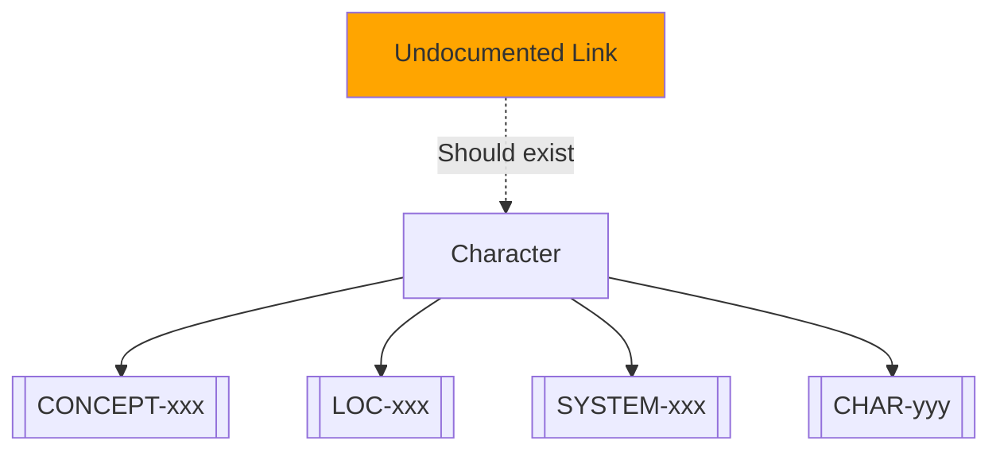

**Problems Found**:

1. **Broken Cross-Reference**:

   - Database links to: [[CONCEPT-xxx]]
   - Concept doesn't exist/was deleted
   - **Issue**: [Dead link]

2. **Missing Cross-Reference**:

   - Character uses [[SYSTEM-xxx]] in chapter \_\_
   - Not documented in either database
   - **Issue**: [Incomplete documentation]

3. **Contradictory Relationship**:

   - Character database: [Relationship to concept A]
   - Concept database: [Different/no relationship]
   - **Issue**: [One-way or contradictory link]

4. **Wrong Timeline Reference**:
   - Character database: [[TIMELINE-xxx]]
   - Timeline doesn't include character
   - **Issue**: [Mismatch]

**REVISION ACTIONS**:

- [ ] Remove dead links:
  - Delete reference to: [[XXX-xxx]]
  - Reason: [No longer exists]
- [ ] Add missing cross-references:
  - Link to: [[SYSTEM-xxx]] - [Relationship]
  - Link to: [[LOC-xxx]] - [Connection]
  - Update both databases (bidirectional)
- [ ] Synchronize references:
  - Update [[CONCEPT-xxx]] to match
  - Update [[CHAR-yyy]] to match
  - Ensure relationship is bidirectional
- [ ] Correct timeline references:
  - Add character to: [[TIMELINE-xxx]]
  - OR remove reference if not applicable

---

## SECTION 15: DEVELOPMENT TRACKING AUDIT

### 15.1 Consistency Checkpoint Verification

**Database Entry**:

- **Consistency Checkpoints**: [From database]
- **Evolution Markers**: [From database]
- **Relationship Milestones**: [From database]

**Checkpoint Validation**:
| Checkpoint | Database Chapter | Actual Chapter | Verified? | Issue |
|------------|------------------|----------------|-----------|-------|
| [Checkpoint] | [#] | [#] | [Y/N] | [Details] |

**Evolution Marker Tracking**:

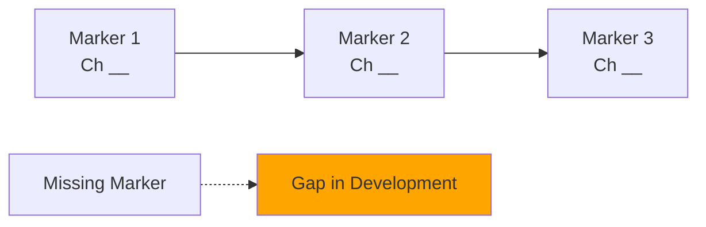

**Relationship Milestone Check**:
| Milestone | Database | Chapter | Occurs? | Quality | Issue |
|-----------|----------|---------|---------|---------|-------|
| [Milestone with CHAR-xxx] | [Ch #] | [Actual] | [Y/N] | [Rating] | [Details] |

**Problems Found**:

1. **Checkpoint Not Met**:

   - Database: Should verify [Trait] in chapter \_\_
   - Story: Chapter doesn't address this
   - **Issue**: [Missing verification moment]

2. **Missing Evolution Markers**:

   - Gap between chapters ** and **
   - Character changes without markers
   - **Issue**: [Sudden unexplained development]

3. **Skipped Relationship Milestone**:
   - Database plans: [Milestone]
   - Never happens in story
   - **Issue**: [Relationship development incomplete]

**REVISION ACTIONS**:

- [ ] Add checkpoint scene:
  - Chapter \_\_: [Scene verifying consistency]
  - Demonstrates: [Trait/Behavior]
- [ ] Add evolution markers:
  - Chapter \_\_: [Sign of change]
  - Chapter \_\_: [Further development]
  - Progressive: [Show gradual shift]
- [ ] Add relationship milestone:
  - Chapter \_\_: [Scene with CHAR-xxx]
  - Milestone: [What develops]
- [ ] Update database:
  - Actual checkpoints: [List with chapters]
  - Actual markers: [List with chapters]
  - Actual milestones: [List with chapters]
