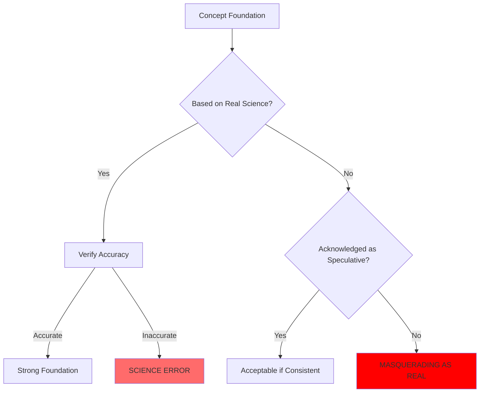
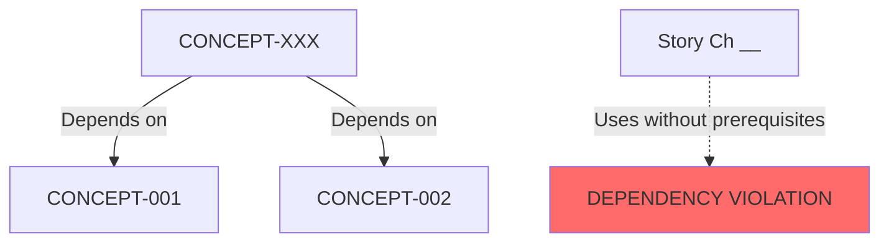
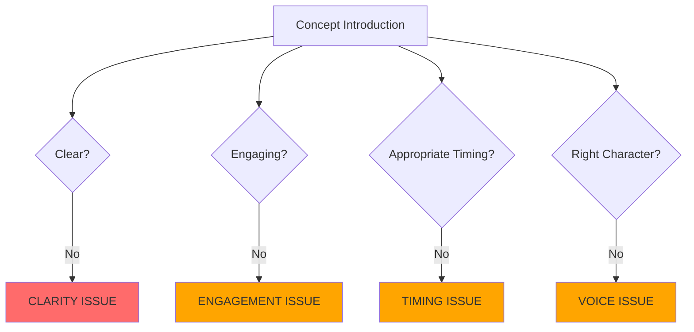
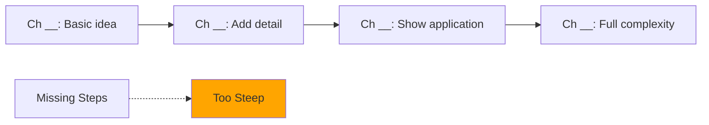
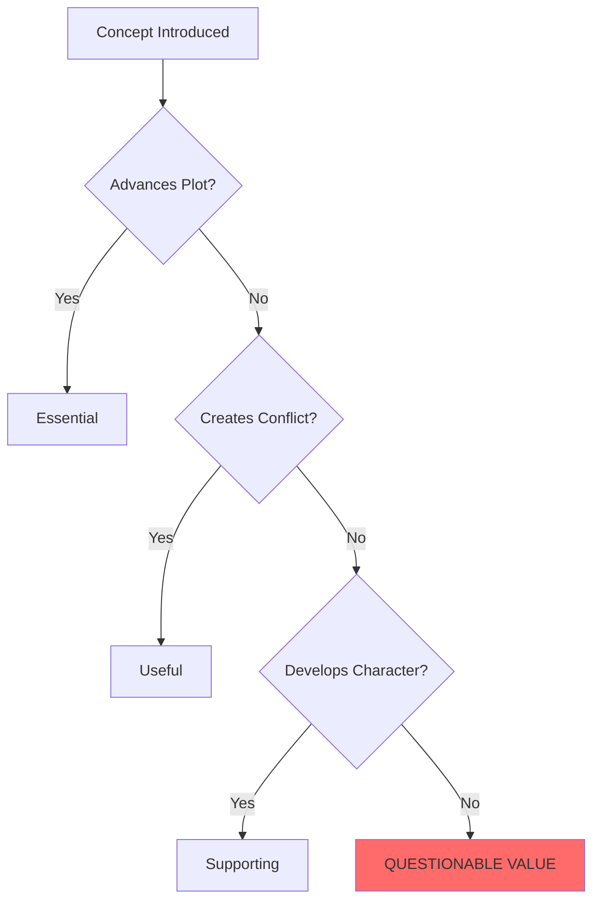
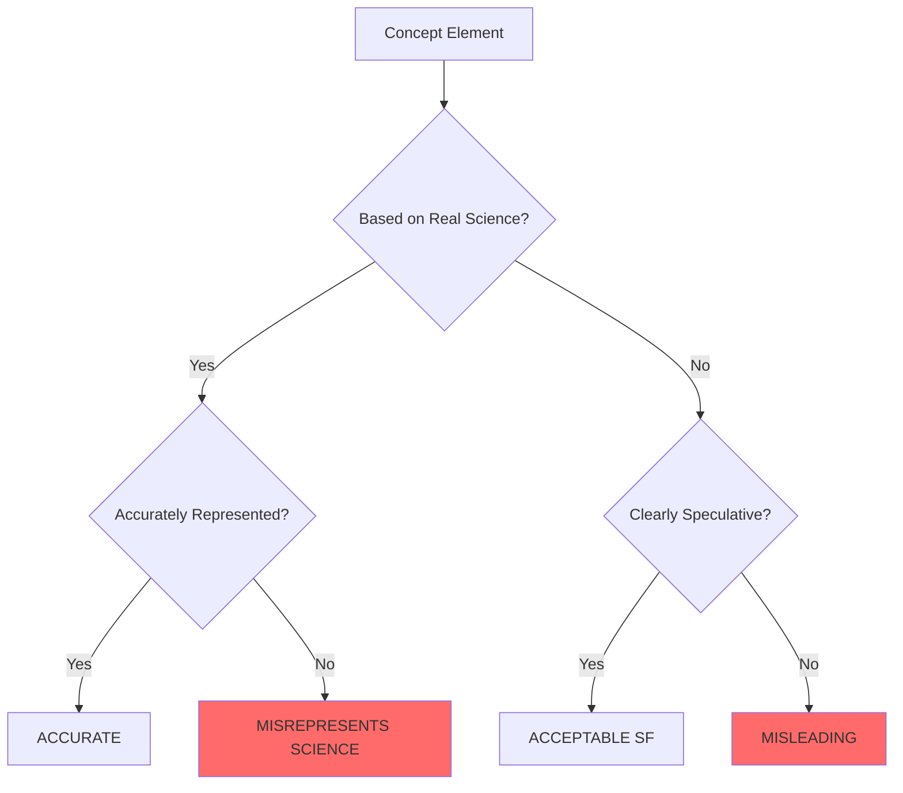

# Concept Coherence Audit & Revision Template
## Hard Science Fiction - Concept Database Analysis

**Concept ID**: [CONCEPT-XXX]  
**Concept Name**: _____________________  
**Audit Date**: _____________________  
**Audited By**: _____________________  
**Book/Chapter Range**: _____________________

---

## SECTION 1: BASIC INFORMATION AUDIT


### 1.1 Naming & Classification Coherence

**Database Entry Review**:
- **Concept Name**: [From database]
- **Category**: [From database]
- **Alternative Names**: [From database]

**Story Usage Analysis**:
| Chapter | Name Used | Category Implied | Matches Database? | Confusion Risk? | Issue |
|---------|-----------|------------------|-------------------|-----------------|-------|
| [#] | [Term variant] | [How categorized] | [Y/N] | [Y/N] | [Details] |

**Naming Consistency Check**:
```mermaid
graph TD
    A[Primary Name:<br/>[Name]] --> B[Used in: Technical contexts]
    C[Alternative: [Alt]] --> D[Used in: Casual contexts]
    E[Other term: [???]] -.->|Undocumented| F[INCONSISTENCY]
    
    style E fill:#FF6B6B
    style F fill:#FF0000
```

**Problems Found**:
1. **Terminology Drift**:
   - Database name: [Name]
   - Story also uses: [Undocumented variant]
   - Chapters: [List]
   - **Issue**: [Reader may not recognize as same concept]

2. **Category Confusion**:
   - Database: [Category A]
   - Story treats as: [Category B]
   - **Issue**: [Conceptual inconsistency]

3. **Missing Alternative Names**:
   - Characters use: [Informal term]
   - Not documented in database
   - **Issue**: [Incomplete terminology map]

**REVISION ACTIONS**:
- [ ] Standardize terminology:
   - Primary name: [Choose one]
   - Alternative names: [List all variants]
   - Update database with all variants
   - Define when each is used
- [ ] Add missing alternatives:
   - Term: [Undocumented name]
   - Context: [When used]
   - Used by: [Which characters/situations]
- [ ] Correct category:
   - Update database to: [Actual category]
   - OR revise story to match database
- [ ] Unify usage across chapters:
   - Technical contexts: Use [Name]
   - Casual contexts: Use [Name]
   - Revise chapters: [List]

---

## SECTION 2: DEFINITION & DESCRIPTION AUDIT

### 2.1 Core Definition Coherence

**Database Entry**:
- **Core Definition**: [From database]
- **Extended Description**: [From database]
- **Key Characteristics**: [From database]
- **Scope**: [From database]

**Definition Consistency Matrix**:
| Database Definition | Chapter | How Explained/Shown | Matches? | Drift Type | Issue |
|---------------------|---------|---------------------|----------|------------|-------|
| [Core definition] | [#] | [Actual usage/explanation] | [Y/N] | [Expansion/Contradiction/Vague] | [Details] |

**Scope Verification**:
```mermaid
graph TD
    A[Database Scope:<br/>[Defined boundaries]] --> B{Story Respects?}
    B -->|Yes| C[Consistent]
    B -->|No| D[Scope Creep]
    
    E[Chapter __] -.->|Expands beyond scope| D
    F[Chapter __] -.->|Contradicts scope| D
    
    style D fill:#FFA500
```

**Key Characteristics Check**:
| Characteristic | Database | Chapter | Demonstrated? | Contradicted? | Issue |
|----------------|----------|---------|---------------|---------------|-------|
| [Trait 1] | [Description] | [#] | [Y/N] | [Y/N] | [Details] |
| [Trait 2] | [Description] | [#] | [Y/N] | [Y/N] | [Details] |

**Problems Found**:
1. **Definition Drift**:
   - Database: Concept is [X]
   - Chapter __: Concept becomes [Y]
   - **Issue**: [Meaning shifts without explanation]

2. **Vague Core Definition**:
   - Database definition: [Too broad/unclear]
   - Story shows: [Multiple interpretations]
   - **Issue**: [Lack of precision causes confusion]

3. **Characteristic Violation**:
   - Database: Concept has property [X]
   - Chapter __: Concept shown without [X]
   - **Issue**: [Breaks established rules]

4. **Scope Creep**:
   - Database: Concept applies to [Limited domain]
   - Story: Applied to [Everything]
   - **Issue**: [Over-extended, loses meaning]

5. **Underdeveloped Characteristics**:
   - Database lists: [Multiple characteristics]
   - Story demonstrates: [Only one]
   - **Issue**: [Incomplete presentation]

**REVISION ACTIONS**:
- [ ] Sharpen core definition:
   - Current (vague): [Database definition]
   - Revised (precise): [New definition]
   - Update database
- [ ] Unify definition across story:
   - Canonical definition: [Choose version]
   - Revise chapters: [List] to match
- [ ] Constrain scope:
   - Limit to: [Specific domain]
   - Remove over-applications in chapters: [List]
   - Add explanation for boundaries
- [ ] Add characteristic demonstrations:
   - Chapter __: Show [Trait 1]
   - Chapter __: Show [Trait 2]
- [ ] Document evolution:
   - If definition must change: Add explicit moment
   - Chapter __: [Event that expands/refines concept]
   - Update database with versioning
- [ ] Remove contradictions:
   - Chapter __: Revise [Scene] to respect [Characteristic]

---

## SECTION 3: SCIENTIFIC/TECHNICAL FOUNDATION AUDIT

### 3.1 Scientific Basis Verification

**Database Entry**:
- **Scientific Basis**: [From database]
- **Speculative Elements**: [From database]
- **Dependencies**: [From database]
- **Enables/Supports**: [From database]

**Scientific Accuracy Assessment**:
| Real Science Claimed | Actual Science | Accurate? | Issue |
|----------------------|----------------|-----------|-------|
| [Database claim] | [Reality check] | [Y/N] | [Details] |

**Hard SF Compliance Check**:


**Speculation vs. Reality Boundary**:
| Element | Database Says | Actually | Mislabeled? | Issue |
|---------|---------------|----------|-------------|-------|
| [Component] | [Real/Speculative] | [Fact check] | [Y/N] | [Details] |

**Dependency Network Validation**:


**Dependency Verification Matrix**:
| Database Dependency | Required? | Established First? | Story Respects? | Issue |
|---------------------|-----------|-------------------|-----------------|-------|
| [[CONCEPT-xxx]] | [Y/N] | [Ch where intro'd] | [Y/N] | [Details] |

**Enablement Check**:
| Database Claims Enables | Chapter | Actually Enables? | Logical? | Issue |
|-------------------------|---------|-------------------|----------|-------|
| [Function] | [#] | [Y/N] | [Y/N] | [Details] |

**Problems Found**:
1. **Pseudoscience Masquerading**:
   - Database: Claims based on [Real principle]
   - Reality: [Principle doesn't work that way]
   - Not marked speculative
   - **Issue**: [Misleading readers]

2. **Insufficient Scientific Basis**:
   - Database: [Vague science handwave]
   - Story requires: [Specific mechanism]
   - **Issue**: [Foundation too weak for story demands]

3. **Missing Dependencies**:
   - Concept requires: [[CONCEPT-xxx]]
   - Not documented in database
   - [[CONCEPT-xxx]] not established first
   - **Issue**: [Concept appears from nowhere]

4. **Circular Dependencies**:
   - Concept A depends on B
   - Concept B depends on A
   - **Issue**: [Logical impossibility]

5. **Overstated Enablement**:
   - Database: Concept enables [X, Y, Z]
   - Story logic: Only could enable [X]
   - **Issue**: [Overpromising capability]

**REVISION ACTIONS**:
- [ ] Correct scientific basis:
   - Update database: [Accurate science]
   - OR clearly mark as speculative
   - Cite sources if using real science
- [ ] Mark speculation clearly:
   - Database section: Move [Element] to Speculative
   - Add story note: "We don't know if this is possible, but if..."
- [ ] Add missing dependency:
   - Document: [[CONCEPT-xxx]] is prerequisite
   - Verify introduced first: Chapter __
   - If not, establish in chapter: __
- [ ] Break circular dependency:
   - Remove dependency: [Which one]
   - OR add third concept that bootstraps both
- [ ] Reduce enablement claims:
   - Remove: [Function it doesn't logically enable]
   - Update database
- [ ] Strengthen foundation:
   - Add scientific detail: [Mechanism]
   - Reference: [Real science principle]
   - Add to database

---

### 3.2 Internal Logic Coherence

**Speculative Element Consistency**:
| Speculative Element | Rule Established | Chapter | Violated? | How | Issue |
|---------------------|------------------|---------|-----------|-----|-------|
| [Element] | [Rule from DB] | [#] | [Y/N] | [Details] | [Severity] |

**Logic Chain Verification**:
```
If [Premise A] (from database)
And [Premise B] (from database)
Then [Conclusion C] (from database)

Story Chapter __:
Shows [Premise A]: [Y/N]
Shows [Premise B]: [Y/N]
Reaches [Conclusion C]: [Y/N]
Logic valid?: [Y/N]
```

**Problems Found**:
1. **Internal Contradiction**:
   - Database property: [X]
   - Database property: [Y]
   - **Issue**: [X and Y are logically incompatible]

2. **Story Violates Own Rules**:
   - Database rule: [Constraint]
   - Chapter __: Breaks this rule
   - **Issue**: [Inconsistent internal logic]

**REVISION ACTIONS**:
- [ ] Resolve logical contradiction:
   - Remove property: [Which one]
   - OR add mediating condition: [Explanation]
- [ ] Enforce internal rules:
   - Chapter __: Revise to respect [Constraint]
- [ ] Update rules:
   - If story evolution requires: Document new rule
   - Explain evolution in chapter: __

---

## SECTION 4: COMPLEXITY ASSESSMENT AUDIT

### 4.1 Difficulty Level Accuracy

**Database Entry**:
- **Difficulty Level**: [From database]
- **Prerequisites**: [From database]
- **Learning Curve**: [From database]

**Actual Complexity Analysis**:
| Database Claims | Story Reality | Match? | Issue |
|-----------------|---------------|--------|-------|
| Difficulty: [Level] | [How complex it actually is] | [Y/N] | [Details] |
| Prerequisites: [List] | [What readers actually need] | [Y/N] | [Details] |
| Learning curve: [Description] | [How hard to grasp] | [Y/N] | [Details] |

**Reader Comprehension Assessment**:
```mermaid
graph LR
    A[Concept Introduced<br/>Ch __] --> B{Readers Understand?}
    B -->|Immediately| C[Difficulty: Beginner]
    B -->|After examples| D[Difficulty: Intermediate]
    B -->|After multiple exposures| E[Difficulty: Advanced]
    B -->|Maybe never fully| F[Difficulty: Expert]
    
    G[Database Says:<br/>[Level]] -.-> H{Matches Reality?}
    
    style H fill:#FFA500
```

**Prerequisites Gap Check**:
| Listed Prerequisite | Provided Before? | Chapter | Sufficient? | Issue |
|---------------------|------------------|---------|-------------|-------|
| [Concept/Knowledge] | [Y/N] | [#] | [Y/N] | [Details] |

**Problems Found**:
1. **Underestimated Difficulty**:
   - Database: [Beginner]
   - Actually: [Advanced - requires significant background]
   - **Issue**: [Readers unprepared]

2. **Overestimated Difficulty**:
   - Database: [Expert]
   - Actually: [Simple concept explained well]
   - **Issue**: [May intimidate unnecessarily]

3. **Missing Prerequisites**:
   - Concept requires understanding: [X]
   - [X] never explained
   - **Issue**: [Comprehension gap]

4. **Steep Learning Curve**:
   - Database says: [Easy to grasp]
   - Reality: [Very hard, technical, abstract]
   - **Issue**: [Reader frustration]

**REVISION ACTIONS**:
- [ ] Update difficulty rating:
   - Change to: [Realistic level]
   - Update database
- [ ] Add missing prerequisites:
   - Establish [[CONCEPT-xxx]] in chapter: __
   - Before using this concept in chapter: __
- [ ] Simplify presentation:
   - Add analogy in chapter: __
   - Add visualization/demonstration
   - Break into smaller pieces
- [ ] Acknowledge complexity:
   - Database: Note that this is genuinely difficult
   - Story: Add character struggle to understand
   - Don't pretend it's simple
- [ ] Add scaffolding:
   - Chapter __ (early): Simple version
   - Chapter __ (middle): Add complexity
   - Chapter __ (late): Full concept

---

## SECTION 5: NARRATIVE INTEGRATION AUDIT

### 5.1 Introduction Method Verification

**Database Entry**:
- **Introduction Method**: [From database]
  - Scene/Chapter: [From database]
  - Character Vector: [From database]
  - Delivery Style: [From database]

**Actual Introduction Analysis**:
| Database Claims | Story Reality | Match? | Effective? | Issue |
|-----------------|---------------|--------|------------|-------|
| First intro: Ch __ | Actually: Ch __ | [Y/N] | [Y/N] | [Details] |
| Introduced by: [Char] | Actually by: [Char] | [Y/N] | [Y/N] | [Details] |
| Style: [Method] | Actually: [Method] | [Y/N] | [Y/N] | [Details] |

**Introduction Quality Assessment**:


**Problems Found**:
1. **Database Out of Sync**:
   - Database: First appears Ch __
   - Actually: First appears Ch __
   - **Issue**: [Documentation incorrect]

2. **Wrong Character Vector**:
   - Database: Introduced by [[CHAR-expert]]
   - Story: Introduced by [[CHAR-novice]]
   - **Issue**: [Lacks authority/clarity]

3. **Info Dump Introduction**:
   - Delivery: [Dense exposition]
   - Reader impact: [Overwhelming/Boring]
   - **Issue**: [Poor introduction method]

4. **Premature Introduction**:
   - Introduced: Chapter __
   - First needed: Chapter __ (much later)
   - **Issue**: [Readers forget by time it matters]

5. **Too Late Introduction**:
   - Needed for plot: Chapter __
   - Introduced: Chapter __ (after needed)
   - **Issue**: [Deus ex machina feel]

**REVISION ACTIONS**:
- [ ] Update database:
   - Correct chapter: __
   - Correct character: [[CHAR-xxx]]
   - Correct delivery style: [Actual method]
- [ ] Change introduction method:
   - From: [Current method]
   - To: [Better method - show/demonstrate/analogize]
   - Revise chapter: __
- [ ] Adjust timing:
   - Move introduction to chapter: __
   - Reason: [Closer to first use / After prerequisite established]
- [ ] Change character vector:
   - From: [[CHAR-xxx]]
   - To: [[CHAR-yyy]] (who has expertise/authority)
   - Revise scene in chapter: __
- [ ] Break up info dump:
   - Chapter __ (intro): [Basic concept only]
   - Chapter __ (develop): [Add detail]
   - Chapter __ (complete): [Full complexity]

---

### 5.2 Explanation Techniques Audit

**Database Entry**:
- **Explanation Techniques**: [From database]
  - Analogies: [From database]
  - Visualizations: [From database]
  - Gradual Revelation: [From database]

**Technique Effectiveness Check**:
| Technique | Database | Chapter | Used? | Effective? | Issue |
|-----------|----------|---------|-------|------------|-------|
| Analogy: [Example] | [Listed] | [#] | [Y/N] | [Y/N] | [Details] |
| Visualization: [Type] | [Listed] | [#] | [Y/N] | [Y/N] | [Details] |
| Gradual reveal: [Method] | [Listed] | [#] | [Y/N] | [Y/N] | [Details] |

**Analogy Quality Assessment**:
```
Database Analogy: [Concept] is like [Common thing]
Effectiveness:
- Familiar?: [Is common thing actually familiar?]
- Accurate?: [Does it capture key features?]
- Misleading?: [Does it suggest wrong properties?]
- Memorable?: [Will readers remember it?]
Overall: [Strong / Adequate / Weak / Misleading]
```

**Visualization Clarity**:
| Visualization | Chapter | Reader Can Picture It? | Helps Understanding? | Issue |
|---------------|---------|------------------------|---------------------|-------|
| [Description] | [#] | [Y/N] | [Y/N] | [Details] |

**Gradual Revelation Mapping**:


**Reader Comprehension Aids Assessment**:
**Database Entry**:
- **Context Clues**: [From database]
- **Repetition**: [From database]
- **Accessibility Score**: [From database]

**Actual Accessibility**:
- **Context provided**: [Sufficient / Insufficient]
- **Repetition frequency**: [Too much / Right / Too little]
- **Realistic accessibility score**: [1-10]
- **Match database?**: [Y/N]

**Problems Found**:
1. **Weak Analogy**:
   - Database: "Like [X]"
   - Problem: [Most readers don't know X / Analogy misleading]
   - **Issue**: [Doesn't help understanding]

2. **Unclear Visualization**:
   - Attempts to show: [Concept]
   - Description too abstract/vague
   - **Issue**: [Readers can't picture it]

3. **Missing Gradual Steps**:
   - Jump from: [Simple version]
   - Directly to: [Complex version]
   - **Issue**: [Too steep, readers lost]

4. **Insufficient Repetition**:
   - Complex concept mentioned once
   - Never reinforced
   - **Issue**: [Readers forget/don't internalize]

5. **Overoptimistic Accessibility**:
   - Database: [Accessibility 8/10]
   - Reality: [More like 4/10 - very technical]
   - **Issue**: [Unrealistic expectations]

**REVISION ACTIONS**:
- [ ] Improve analogy:
   - Replace [Current] with [Better everyday example]
   - Test: Ask "Would my mom understand this?"
   - Add to chapter: __
- [ ] Add visualization:
   - Chapter __: Character draws/demonstrates
   - Describe visual clearly: [Concrete details]
- [ ] Create gradual revelation:
   - Chapter __: [Level 1 - basic]
   - Chapter __: [Level 2 - intermediate]
   - Chapter __: [Level 3 - full]
- [ ] Add repetition:
   - Reference again in chapters: [List]
   - Each time add small new detail
   - Reinforce key points
- [ ] Add context clues:
   - Chapter __: [Surrounding information]
   - Help readers infer meaning
- [ ] Update accessibility score:
   - Realistic score: [New rating]
   - Update database
- [ ] Simplify if needed:
   - Remove unnecessary complexity
   - Focus on what's essential for plot

---

## SECTION 6: STORY FUNCTION AUDIT

### 6.1 Plot Role Verification

**Database Entry**:
- **Plot Role**: [From database]
- **Thematic Connection**: [From database]
- **Character Development**: [From database]
- **Conflict Generation**: [From database]

**Plot Role Validation**:
| Database Claims | Chapter | Actually Serves Role? | Effectively? | Issue |
|-----------------|---------|----------------------|--------------|-------|
| [Plot function] | [#] | [Y/N - How] | [Y/N] | [Details] |

**Plot Integration Analysis**:


**Thematic Connection Check**:
| Story Theme | Database Connection | Chapter | Actually Connected? | Strength | Issue |
|-------------|---------------------|---------|---------------------|----------|-------|
| [Theme] | [How concept relates] | [#] | [Y/N - Evidence] | [Strong/Weak] | [Details] |

**Character Development Impact**:
| Character | Database Claim | Chapter | Actual Impact | Match? | Issue |
|-----------|----------------|---------|---------------|--------|-------|
| [[CHAR-xxx]] | [How they interact] | [#] | [What happens] | [Y/N] | [Details] |

**Conflict Generation Assessment**:
- **Database claims creates**: [Conflict type]
- **Actually creates in story**: [Y/N - Description]
- **Conflict quality**: [Weak / Moderate / Strong]
- **Drives plot forward**: [Y/N]

**Problems Found**:
1. **No Clear Plot Function**:
   - Concept introduced and explained
   - Never impacts plot
   - **Issue**: [Wasted pages on irrelevant worldbuilding]

2. **Weak Thematic Connection**:
   - Database: Supports theme of [X]
   - Story: Connection barely visible
   - **Issue**: [Thematic potential unfulfilled]

3. **Missed Character Development**:
   - Database: Character grows through [Concept]
   - Story: Character barely engages with it
   - **Issue**: [Lost development opportunity]

4. **Unfulfilled Conflict**:
   - Database: Concept creates [Conflict]
   - Story: Conflict never materializes
   - **Issue**: [Setup without payoff]

5. **Concept Solves Too Easily**:
   - Introduced to solve problem
   - Works perfectly, no complications
   - **Issue**: [Deus ex machina, no tension]

**REVISION ACTIONS**:
- [ ] Add plot function:
   - Chapter __: Concept becomes crucial to [Plot event]
   - Makes difference: [How]
- [ ] Strengthen thematic tie:
   - Chapter __: Character dialogue about [Thematic question]
   - Concept illustrates: [Theme aspect]
- [ ] Create character development:
   - Chapter __: [[CHAR-xxx]] struggles with concept
   - Chapter __: Achieves understanding/mastery
   - Growth shown through: [How]
- [ ] Generate conflict:
   - Chapter __: Concept creates problem: [Specific]
   - Characters must deal with: [Consequence]
- [ ] Add complications:
   - Concept works BUT: [Downside/Cost]
   - Creates new problem: [What]
   - Chapter __: Deal with complications
- [ ] Remove concept:
   - If serves no function: Delete from story
   - Redistribute any minor functions
   - Simplify narrative

---

## SECTION 7: USAGE TRACKING AUDIT

### 7.1 Appearance & Reference Verification

**Database Entry**:
- **First Appearance**: [From database]
- **Referenced In**: [List from database]
- **Key Payoff Scenes**: [From database]
- **Evolution Over Story**: [From database]

**Actual Appearance Tracking**:
| Database Claims | Story Reality | Match? | Issue |
|-----------------|---------------|--------|-------|
| First: Ch __ | Actually: Ch __ | [Y/N] | [Details] |
| Referenced: [List] | Actually: [List] | [Y/N] | [Details] |
| Payoffs: [List] | Actually: [List] | [Y/N] | [Details] |

**Reference Frequency Analysis**:

```mermaid
gantt
    title Concept References Across Story
    dateFormat X
    axisFormat %s
    
    section References
    Ch 1-5 :0, 5
    Ch 6-10 :6, 10
    Gap :10, 15
    Ch 16-20 :16, 20
```


**Long Absence Check**:
- **Introduced**: Chapter __
- **Referenced again**: Chapter __ ([X] chapters later)
- **Problem?**: [Readers may forget / Acceptable for minor concept]

**Key Payoff Verification Matrix**:
| Database Payoff | Expected Chapter | Actual Chapter | Occurs? | Satisfying? | Issue |
|-----------------|------------------|----------------|---------|-------------|-------|
| [Payoff scene] | [#] | [Actual] | [Y/N] | [Y/N] | [Details] |

**Evolution Tracking**:
```mermaid
graph LR
    A[Early: [Simple version]] --> B[Middle: [Developed]]
    B --> C[Late: [Complex/Applied]]
    
    D[Database Plan] -.-> E{Matches Story?}
    F[Actual Story] -.-> E
    E -->|No| G[EVOLUTION MISMATCH]
    
    style G fill:#FFA500
```

**Problems Found**:
1. **Database Out of Date**:
   - First appearance wrong
   - Reference list incomplete
   - **Issue**: [Documentation doesn't match story]

2. **Forgotten Concept**:
   - Introduced: Chapter __
   - Never mentioned again
   - **Issue**: [Setup without continuation]

3. **Too Long Between References**:
   - Last mention: Chapter __
   - Next mention: Chapter __ (10+ chapters later)
   - **Issue**: [Readers forgot it exists]

4. **Missing Payoff**:
   - Database promises: [Payoff scene]
   - Never occurs
   - **Issue**: [Unfulfilled promise]

5. **Payoff Without Setup**:
   - Crucial to climax: Chapter __
   - Last mentioned: Chapter __ (too long ago)
   - **Issue**: [Feels like it came from nowhere]

6. **Static Concept**:
   - Database: Should evolve
   - Story: Same from start to finish
   - **Issue**: [Missed complexity/depth]

**REVISION ACTIONS**:
- [ ] Update database:
   - Correct first appearance: Chapter __
   - Complete reference list: [All chapters]
   - Actual payoffs: [List]
- [ ] Add reference reminders:
   - Chapter __: Brief mention/callback
   - Keep concept fresh in reader mind
- [ ] Add continuation:
   - Chapter __: Follow up on introduced concept
   - Build toward payoff
- [ ] Add payoff scene:
   - Chapter __: [Promised payoff]
   - Significance: [Why it matters]
- [ ] Move payoff:
   - From: Chapter __ (too late)
   - To: Chapter __ (closer to setup)
- [ ] Add evolution:
   - Chapter __: Concept begins to change
   - Chapter __: New understanding/application
   - Chapter __: Full evolution realized
- [ ] Remove concept:
   - If no payoff and no function: Delete
   - Chapters to revise: [List]

---

## SECTION 8: ACCURACY & VALIDATION AUDIT

### 8.1 Scientific Accuracy Verification

**Database Entry**:
- **Scientific Accuracy**: [From database]
- **Internal Consistency**: [From database]
- **External Consistency**: [From database]
- **Potential Issues**: [From database]

**Accuracy Classification Check**:
| Database Rating | Fact Check | Actual Rating | Match? | Issue |
|-----------------|------------|---------------|--------|-------|
| [Realistic/Speculative/Problematic] | [Research result] | [True rating] | [Y/N] | [Details] |

**Scientific Accuracy Verification**:


**External Consistency Check**:
| Real Science Principle | Concept Compatibility | Consistent? | Issue |
|------------------------|----------------------|-------------|-------|
| [Established science] | [How concept relates] | [Y/N] | [Details] |

**Internal Consistency Verification**:
| Story Element 1 | Story Element 2 | Logically Compatible? | Issue |
|-----------------|-----------------|----------------------|-------|
| [Concept property A] | [Concept property B] | [Y/N] | [Details] |

**Documented Issues Check**:
- **Database lists**: [Potential issues]
- **Actually problematic?**: [Y/N - Assessment]
- **Additional issues found**: [List]
- **Database complete?**: [Y/N]

**Problems Found**:
1. **Misrepresented Real Science**:
   - Database: "Based on [Real