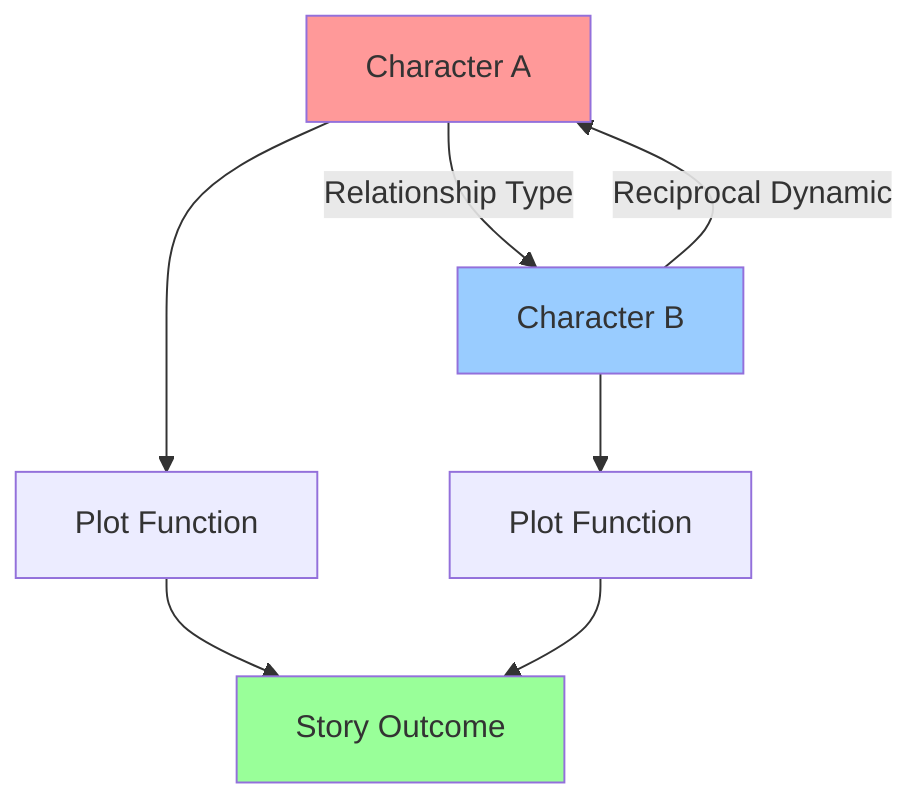
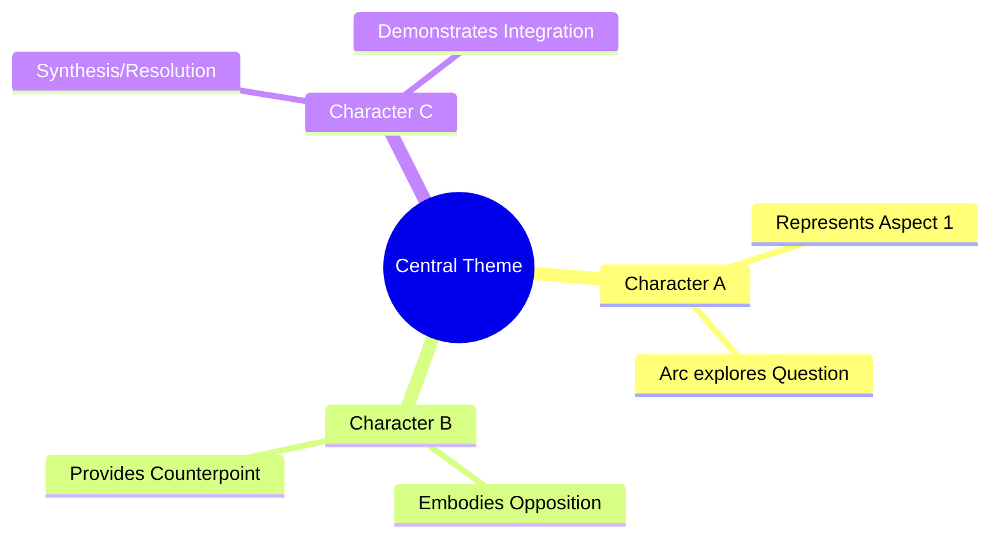
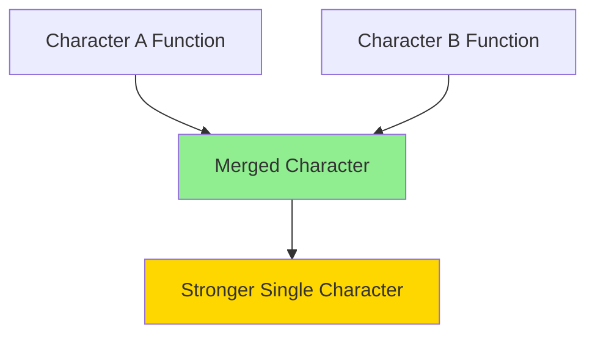
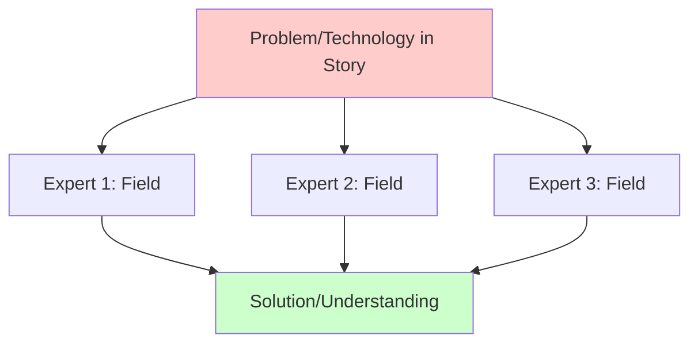
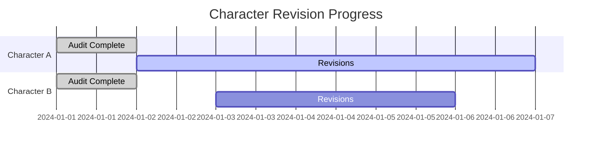

# Character Audit & Resolution Template
## Hard Science Fiction Character Collection Analysis

---

## SECTION 1: INDIVIDUAL CHARACTER AUDIT

### Character: [Character Name] - ID: [CHAR-XXX]

#### A. Hard SF Coherence Check
**Scientific Accuracy Assessment**
- [ ] Technical knowledge matches stated expertise level
- [ ] Problem-solving approaches align with scientific method
- [ ] Technology interactions are internally consistent
- [ ] Specialized knowledge doesn't exceed plausible acquisition timeframe

**Realism Score**: [1-10] _____
**Issues Identified**: 
- [List any scientific inconsistencies]

**Resolution Actions**:
- [ ] Adjust expertise level in character database
- [ ] Add training/experience backstory
- [ ] Modify dialogue to reflect actual knowledge level
- [ ] Add consultant character for out-of-expertise situations

---

#### B. Character Consistency Audit

**Behavioral Consistency**
- [ ] Actions match stated motivations across all chapters
- [ ] Decision-making patterns remain true to personality
- [ ] Emotional responses align with psychological profile
- [ ] Skills demonstrated match listed competencies

**Inconsistencies Found**:
| Chapter | Issue | Severity (1-5) | Root Cause |
|---------|-------|----------------|------------|
| [Ch #] | [Description] | [#] | [Cause] |

**Resolution Plan**:
- [ ] Rewrite specific scenes: [List chapters]
- [ ] Add character development moment to justify change
- [ ] Update character database entry
- [ ] Add foreshadowing in earlier chapters

---

#### C. Arc Progression Evaluation

**Arc Strength**: [Weak / Adequate / Strong / Compelling]

**Milestones Achieved**:

**Arc Issues**:
- [ ] Insufficient motivation for transformation
- [ ] Change too abrupt/unrealistic
- [ ] Missing middle development
- [ ] Unsatisfying resolution
- [ ] Arc doesn't serve story theme

**Resolution Actions**:
- [ ] Add bridging scenes in chapters: _____
- [ ] Strengthen catalyst moment in chapter: _____
- [ ] Extend arc across additional chapters
- [ ] Reduce arc scope to match page time
- [ ] **RADICAL**: Merge arc with another character

---

## SECTION 2: ENSEMBLE ANALYSIS

### A. Character Interaction Matrix

**Create for each major relationship pair**

**Interaction Quality Assessment**:
| Char 1 | Char 2 | Scenes Together | Chemistry Rating | Plot Relevance | Issues |
|--------|--------|-----------------|------------------|----------------|--------|
| [Name] | [Name] | [#] | [1-10] | [High/Med/Low] | [Notes] |

**Resolution Strategies**:
- [ ] Add shared scenes to develop chemistry
- [ ] Remove forced interactions
- [ ] Create conflict point to generate tension
- [ ] Establish shared goal/problem
- [ ] Kill off one character to raise stakes

---

### B. Cast Size & Distribution Analysis

**Current Statistics**:
- Total Characters: _____
- POV Characters: _____
- Major Supporting: _____
- Minor Characters: _____
- Mentioned-Only: _____

**Chapter Presence Heatmap**:

```mermaid
gantt
    title Character Appearances by Chapter
    dateFormat X
    axisFormat %s
    
    section Character A
    Appearances :0, 15
    
    section Character B
    Appearances :3, 18
    
    section Character C
    Appearances :0, 8
    Appearances :12, 20
```

**Balance Issues**:
- [ ] Too many POV characters diluting focus
- [ ] Major character absent for too long
- [ ] Minor character overstaying narrative purpose
- [ ] Protagonist lacks sufficient page time
- [ ] Uneven distribution creates pacing issues

**Resolution Actions**:
- [ ] **MERGE**: Combine [Character X] + [Character Y]
- [ ] **REMOVE**: Delete [Character Z] - redistribute functions
- [ ] **DEMOTE**: Reduce [Character A] from POV to supporting
- [ ] **PROMOTE**: Expand [Character B] role in chapters: _____
- [ ] **REDISTRIBUTE**: Move scenes from [X] to [Y]

---

### C. Diversity & Representation Audit

**Representation Map**:
| Dimension | Characters | Balance | Stereotypes? | Action Needed |
|-----------|------------|---------|--------------|---------------|
| Gender | [List] | [Ratio] | [Y/N] | [Notes] |
| Ethnicity | [List] | [Ratio] | [Y/N] | [Notes] |
| Age | [List] | [Ratio] | [Y/N] | [Notes] |
| Neurodiversity | [List] | [Ratio] | [Y/N] | [Notes] |
| Disability | [List] | [Ratio] | [Y/N] | [Notes] |

**Hard SF Specific**:
- [ ] Scientific expertise diversity (multiple disciplines)
- [ ] Problem-solving approach diversity
- [ ] Cultural perspectives on technology
- [ ] Different relationships with scientific method

**Resolution Actions**:
- [ ] Adjust existing character backgrounds
- [ ] Add new character to fill gap: [Role/Chapter]
- [ ] Deepen cultural authenticity research
- [ ] Consult sensitivity readers for: _____

---

## SECTION 3: THEMATIC & PLOT INTEGRATION

### A. Thematic Embodiment Matrix

**Theme**: [Primary Theme]

**Theme Carrier Assessment**:
| Theme | Primary Character | Support Characters | Clarity | Redundancy |
|-------|-------------------|-------------------|---------|------------|
| [Theme 1] | [Name] | [Names] | [High/Med/Low] | [Y/N] |

**Resolution Actions**:
- [ ] Strengthen thematic dialogue for: _____
- [ ] Add symbolic moment in chapter: _____
- [ ] Remove redundant theme carrier: _____
- [ ] Clarify thematic position through action

---

### B. Plot Function Necessity Check

**For Each Character**:
1. **Unique Plot Functions**: [List what ONLY this character can do]
2. **Redundant Functions**: [What others could do]
3. **Necessity Score**: [Essential / Important / Optional / Removable]

**Consolidation Opportunities**:

**Resolution Actions**:
- [ ] **MERGE CANDIDATES**: [A] + [B] = [New Character Name]
  - Combine expertise: [List]
  - Merge arcs: [Description]
  - Consolidate relationships: [Plan]
  - First appearance: [Chapter]

- [ ] **ELIMINATION CANDIDATE**: [Character X]
  - Redistribute plot functions to: _____
  - Remove from chapters: _____
  - Adjust dependent relationships: _____

---

## SECTION 4: HARD SF SPECIFIC AUDITS

### A. Scientific Expertise Web

**Coverage Check**:
- [ ] All major technologies have expert character
- [ ] No single character is omniscient
- [ ] Expertise distribution feels realistic
- [ ] Learning curves are plausible
- [ ] Collaboration necessity is clear

**Gaps Identified**:
- Missing expertise: [Field] - Needed in chapters: _____
- Over-expertise: [Character] knows too much about _____

**Resolution Actions**:
- [ ] Add specialist character: [Field] - [Role]
- [ ] Reduce character's knowledge, add consultation scenes
- [ ] Create mentor relationship to explain knowledge transfer

---

### B. Problem-Solving Style Diversity

**Approach Inventory**:
| Character | Primary Method | Backup Approach | Blind Spots |
|-----------|----------------|-----------------|-------------|
| [Name] | [Analytical/Intuitive/Experimental] | [Method] | [What they miss] |

**Issue**: Too many characters solve problems the same way

**Resolution Actions**:
- [ ] Modify [Character]'s approach to [New Style]
- [ ] Add scenes showing different methodologies
- [ ] Create conflict from methodology differences

---

## SECTION 5: REVISION IMPLEMENTATION PLAN

### A. Character Modification Schedule

**Priority 1: Critical Fixes** (Before next draft)
| Character | Issue | Action | Chapters Affected | Estimated Time |
|-----------|-------|--------|-------------------|----------------|
| [Name] | [Problem] | [Fix] | [List] | [Hours] |

**Priority 2: Enhancement** (Polish draft)
| Character | Goal | Action | Impact |
|-----------|------|--------|--------|
| [Name] | [Improvement] | [Method] | [Benefit] |

**Priority 3: Optimization** (Final draft)
| Area | Change | Reason |
|------|--------|--------|
| [Aspect] | [Modification] | [Purpose] |

---

### B. Character Removal/Merger Protocol

**For Character Scheduled for Removal**: [Name]

**Step 1: Function Redistribution**
- Plot function X → Transfer to [Character Y] in chapter _____
- Relationship function → Transfer to [Character Z]
- Information carrier role → Use [Alternative method]

**Step 2: Scene Rewrite Plan**
| Original Scene | Chapter | New Version | Character Replacement |
|----------------|---------|-------------|----------------------|
| [Description] | [#] | [Revision] | [New char or method] |

**Step 3: Continuity Check**
- [ ] Update all character relationship entries
- [ ] Remove from timeline
- [ ] Adjust chapter summaries
- [ ] Update character count
- [ ] Verify plot still functions

---

### C. New Character Integration

**If Adding New Character**:

**Insertion Point**: Chapter _____
**Justification**: [Why necessary now]
**Integration Method**: [ ] Backfill mentions [ ] Cold intro [ ] Existing character reference

**Setup Requirements**:
- [ ] Create full character database entry
- [ ] Plan introduction scene
- [ ] Map relationship development
- [ ] Schedule key appearances
- [ ] Define arc completion

---

## SECTION 6: READER EXPERIENCE METRICS

### A. Emotional Journey Map

**Emotional Investment Check**:
- [ ] Character introduced at optimal moment
- [ ] Sufficient page time to bond with reader
- [ ] Stakes personal and clear
- [ ] Victories feel earned
- [ ] Losses create genuine impact

---

### B. Character Clarity Assessment

**Reader Differentiation Test**:
- [ ] Character names are distinct
- [ ] Physical descriptions are memorable
- [ ] Speech patterns are unique
- [ ] Motivations are clear
- [ ] Roles are well-defined

**Confusion Risk**:
| Character Pair | Similarity Issue | Resolution |
|----------------|------------------|------------|
| [A] & [B] | [Too similar in X] | [Fix plan] |

---

## SECTION 7: FINAL COHERENCE VERIFICATION

### A. Global Consistency Checklist

**For Entire Character Collection**:
- [ ] No contradictory backstories
- [ ] Timeline of character histories compatible
- [ ] Power/skill levels remain consistent
- [ ] Relationship developments track logically
- [ ] All character arcs reach meaningful conclusion
- [ ] Cast size supports pacing
- [ ] Diversity goals achieved authentically
- [ ] Scientific expertise feels realistic
- [ ] Each character serves clear purpose

---

### B. Story Service Evaluation

**Final Question for Each Character**:
> "If I removed this character entirely, would the story be weaker?"

**YES**: Keep and strengthen
**MAYBE**: Consider merger or role reduction  
**NO**: Remove and redistribute functions

---

## SECTION 8: IMPLEMENTATION TRACKING

### A. Revision Completion Chart

### B. Quality Assurance Sign-Off

- [ ] All Priority 1 fixes completed
- [ ] Beta reader feedback incorporated
- [ ] Sensitivity reader approval (if applicable)
- [ ] Technical accuracy verified
- [ ] Character database updated
- [ ] Timeline cross-references checked
- [ ] Final consistency pass completed

**Audit Completed By**: _____________________  
**Date**: _____________________  
**Next Audit Scheduled**: _____________________

---

## APPENDIX: Quick Reference - Hard SF Character Best Practices

1. **Expertise Realism**: No Renaissance polymaths unless justified
2. **Problem-Solving**: Show scientific method, trial and error
3. **Knowledge Limits**: Characters don't know everything
4. **Collaboration**: Complex problems need multiple experts
5. **Learning Curves**: New knowledge takes time to acquire
6. **Specialization Depth**: Deep knowledge in narrow field > broad shallow knowledge
7. **Cultural Diversity**: Science is global; reflect that
8. **Failure**: Scientists fail often; show the process
9. **Uncertainty**: Acknowledge what characters don't know
10. **Practical Constraints**: Time, resources, politics affect scientific work