# System Coherence Audit & Revision Template
## Hard Science Fiction - Technical System Analysis

**System ID**: [SYSTEM-XXX]  
**System Name**: _____________________  
**Audit Date**: _____________________  
**Audited By**: _____________________  
**Book/Chapter Range**: _____________________

---

## SECTION 1: BASIC INFORMATION AUDIT

### 1.1 Identity & Classification Coherence

**Database Entry Review**:
- **System Name**: [From database]
- **Type**: [From database]
- **Category**: [From database]

**Story Usage Analysis**:
| Chapter | Referred to As | Type Shown | Category Behavior | Matches Database? |
|---------|----------------|------------|-------------------|-------------------|
| [#] | [Name variant] | [Observed type] | [Observed category] | [Y/N] |
| [#] | [Name variant] | [Observed type] | [Observed category] | [Y/N] |

**Naming Consistency Issues**:
- [ ] System called by different names: [List variants]
- [ ] Formal name vs. informal name confusion
- [ ] Acronym/abbreviation used without establishment

**Classification Mismatches**:
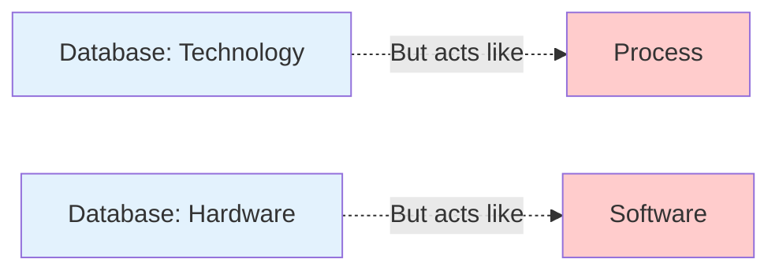

**Identified Issues**:
1. **Issue**: [Description of mismatch]
   - **Evidence**: Chapter __, [specific example]
   - **Severity**: [Minor / Moderate / Critical]
   - **Impact**: [How it affects understanding]

**REVISION ACTIONS**:
- [ ] Standardize name to: [Chosen name]
   - Replace in chapters: [List]
   - Update database entry
- [ ] Reclassify as: [New type/category]
   - Justification: [Why]
   - Update database
   - Add clarification in chapter: __
- [ ] Add naming explanation: [Where character explains formal vs. informal usage]

---

## SECTION 2: TECHNICAL SPECIFICATIONS AUDIT

### 2.1 Scientific Basis Verification

**Database Claims**:
- **Scientific Basis**: [From database]
- **Core Technology**: [From database]

**Scientific Accuracy Check**:
| Claimed Principle | Real-World Status | Story Implementation | Violation? | Severity |
|-------------------|-------------------|----------------------|------------|----------|
| [Principle] | [Established/Theoretical/Speculative] | Ch __ [How used] | [Y/N] | [1-5] |

**Physics Compliance Matrix**:
- [ ] Conservation of Energy: [Pass / Fail - Details: _____ ]
- [ ] Thermodynamics: [Pass / Fail - Details: _____ ]
- [ ] Information Theory: [Pass / Fail - Details: _____ ]
- [ ] Material Science Limits: [Pass / Fail - Details: _____ ]
- [ ] Causality: [Pass / Fail - Details: _____ ]

**Energy Budget Calculation**:
```
System requires: [X] Joules/Watts
Available from: [Source] = [Y] Joules/Watts
Balance: [Y - X] = [Surplus/Deficit]
```

**Feasibility Assessment**:
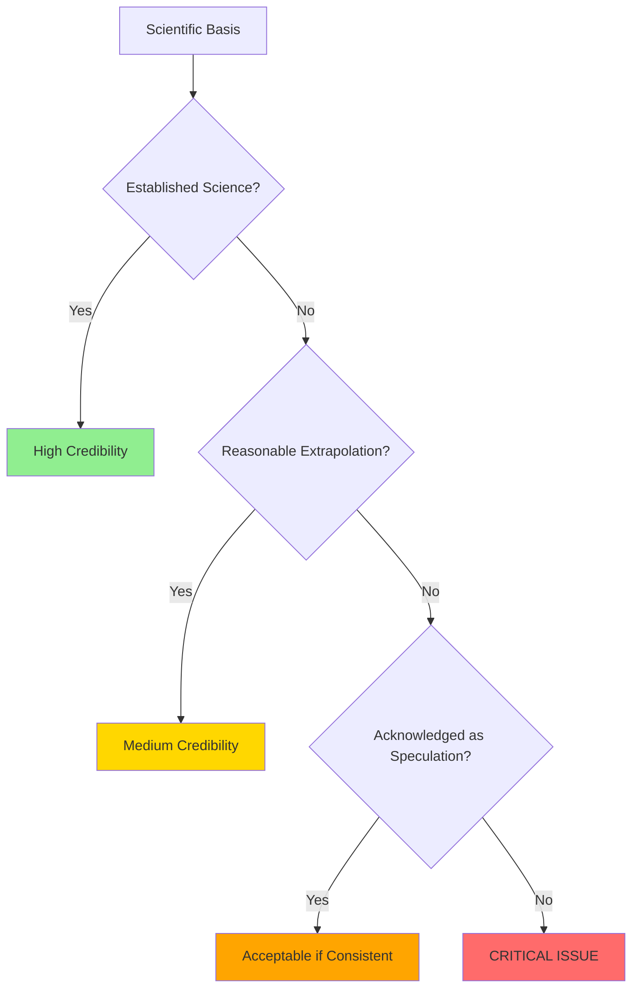

**Result**: [High / Medium / Low / Critical Issue]

**Identified Problems**:
1. **Problem**: [Specific scientific violation]
   - **Location**: Chapter __, page/scene __
   - **Type**: [Physics / Chemistry / Biology / Engineering]
   - **Severity**: [1-5]
   - **Reader Impact**: [Will experts notice? Will casual readers care?]

**REVISION ACTIONS**:
- [ ] Add scientific justification in chapter __:
   - Mechanism: [Explanation to add]
   - Speaker: [Which character explains]
- [ ] Reduce capability to realistic level:
   - Current: [Overpowered feature]
   - Revised: [Scaled-down version]
   - Chapters to revise: [List]
- [ ] Add limiting factor:
   - New constraint: [Specific limitation]
   - Prevents: [What it stops from being too powerful]
   - Introduce in chapter: __
- [ ] Acknowledge speculation:
   - Add character dialogue: "We don't fully understand how..."
   - Location: Chapter __
- [ ] Replace with different approach:
   - Old tech: [Current system]
   - New tech: [Alternative that obeys physics]
   - Rewrite chapters: [List]

---

### 2.2 Scale & Complexity Coherence

**Database Entry**:
- **Scale**: [From database]
- **Complexity Level**: [From database]

**Scale Verification Table**:
| Chapter | Physical Size Shown | Operational Scale | Matches Database? | Issue |
|---------|---------------------|-------------------|-------------------|-------|
| [#] | [Description] | [Individual/Local/Global] | [Y/N] | [Notes] |

**Complexity Consistency Check**:
| Aspect | Database Says | Story Shows | Match? | Problem |
|--------|---------------|-------------|--------|---------|
| Technical sophistication | [Simple/Moderate/Complex/Extreme] | [Observed] | [Y/N] | [Details] |
| Operation difficulty | [Level] | Ch __ [Who uses it, how easily] | [Y/N] | [Details] |
| Maintenance needs | [Level] | Ch __ [What's shown] | [Y/N] | [Details] |
| Failure modes | [Level] | Ch __ [How it breaks] | [Y/N] | [Details] |

**Scale-Complexity Relationship**:
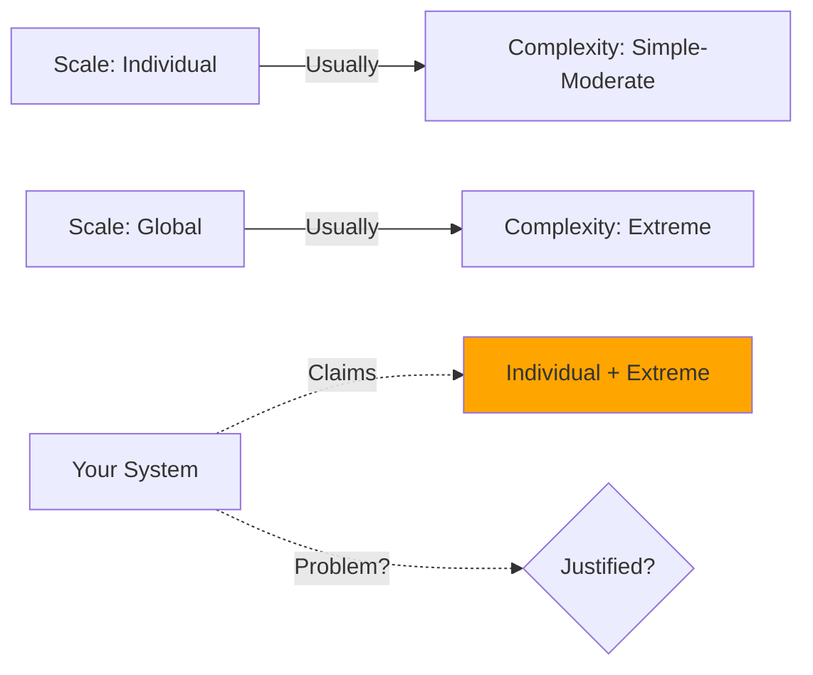

**Assessment**: [Logical / Needs Justification / Contradictory]

**REVISION ACTIONS**:
- [ ] Update scale in database to: [New scale]
- [ ] Update complexity to: [New level]
- [ ] Add explanation for unusual scale-complexity combo:
   - Justification: [Why small scale but extreme complexity, etc.]
   - Location: Chapter __
- [ ] Revise story to match database:
   - Chapters affected: [List]
   - Change: [Specific modifications]

---

## SECTION 3: CAPABILITIES & FUNCTIONS AUDIT

### 3.1 Function Definition Coherence

**Database Definition**:
- **Primary Function**: [From database]
- **Secondary Functions**: [List from database]

**Story Implementation Analysis**:
| Chapter | Function Demonstrated | Primary/Secondary/Undeclared | Matches Database? | Notes |
|---------|----------------------|------------------------------|-------------------|-------|
| [#] | [What it does] | [Category] | [Y/N] | [Details] |

**Function Creep Detection**:
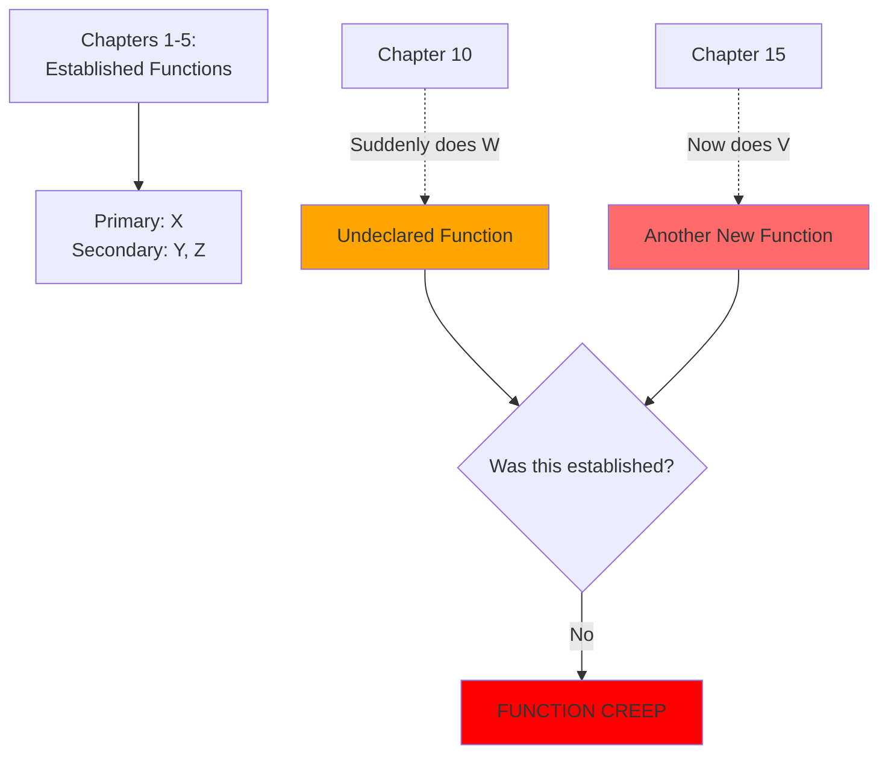

**Undeclared Functions Found**: [Count]
1. [Function]: Appears in chapter __, not in database
2. [Function]: Appears in chapter __, not in database

**Contradictory Functions**:
- Database says system does [X]
- But in chapter __, it explicitly cannot do [X]
- **Contradiction severity**: [Minor / Major / Critical]

**REVISION ACTIONS**:
- [ ] Add new functions to database:
   - Function: [Name and description]
   - Justification: [Why system can do this]
   - Foreshadow in earlier chapter: __
- [ ] Remove contradictory scene:
   - Chapter __: [Scene to delete/modify]
   - Replace with: [Alternative approach]
- [ ] Limit function scope:
   - Current (too broad): [Description]
   - Revised (specific): [Description]
   - Update database and chapters: [List]
- [ ] Split into multiple systems:
   - System A: [Functions 1, 2, 3]
   - System B: [Functions 4, 5] (new system ID: [SYSTEM-YYY])
   - Revise chapters: [List]

---

### 3.2 Performance Metrics & Limitations Audit

**Database Claims**:
- **Performance Metrics**: [From database]
- **Limitations**: [List from database]

**Performance Consistency Table**:
| Metric | Database Value | Chapter | Story Shows | Within Spec? | Variance |
|--------|----------------|---------|-------------|--------------|----------|
| [Speed/Capacity/Range/etc.] | [Number/Description] | [#] | [Actual] | [Y/N] | [%] |

**Limitation Enforcement Check**:
| Limitation | Chapter | Should Prevent | Actually Prevents? | Violation? | Impact |
|------------|---------|----------------|-------------------|------------|--------|
| [Name] | [#] | [Action] | [Y/N] | [Y/N] | [Severity] |

**Critical Issues**:

**A. Performance Inconsistency**:
```
Example:
Database: "Range of 100km"
Chapter 5: Works at 95km ✓
Chapter 12: Works at 250km ✗ (2.5x over spec)
```

**Your System**:
- **Spec**: [Database value]
- **Violation**: Chapter __, shows [actual value]
- **Ratio**: [Actual/Spec = X]
- **Problem**: [Why this breaks things]

**B. Ignored Limitations**:
```
Database: "Cannot operate in vacuum"
Chapter 18: Character uses it on airless moon
```

**Your System**:
- **Limitation**: [From database]
- **Violated in**: Chapter __
- **How**: [Description of violation]
- **Consequences shown**: [None / Inadequate / Appropriate]

**REVISION ACTIONS**:
- [ ] Standardize performance across chapters:
   - Canonical value: [Choose one]
   - Revise chapters: [List where it differs]
- [ ] Add context for variance:
   - Explanation: [Why performance differs]
   - Examples: "Optimal conditions" vs "Degraded conditions"
   - Add in chapter: __
- [ ] Enforce limitation:
   - Chapter __ revision: [How to respect the limit]
   - Alternative approach: [What character does instead]
- [ ] Add consequence for violating limit:
   - Chapter __ (violation): [What happens when limit ignored]
   - Consequence: [System damage/failure/danger]
- [ ] Remove invalid limitation:
   - Limitation to delete: [Which one]
   - Reason: [Story requires this capability]
   - Update database

---

## SECTION 4: OPERATIONAL DETAILS AUDIT

### 4.1 Control & Maintenance Coherence

**Database Claims**:
- **Activation/Control**: [From database]
- **Maintenance Requirements**: [From database]
- **Energy/Power Needs**: [From database]

**Operational Consistency Analysis**:
| Chapter | Who Operates | How Controlled | Difficulty Shown | Matches Database? | Issues |
|---------|--------------|----------------|------------------|-------------------|--------|
| [#] | [Character] | [Method] | [Easy/Hard] | [Y/N] | [Notes] |

**Skill Level Coherence**:
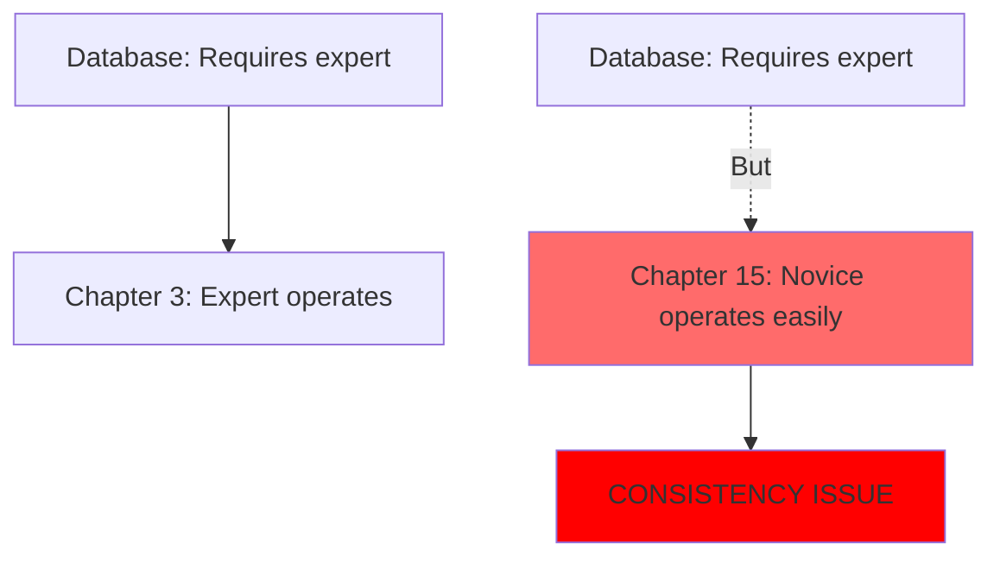

**Expertise Requirement Check**:
- [ ] Complex system operated by appropriate experts
- [ ] Learning curve shown if character gains expertise
- [ ] Mistakes made by inexperienced users
- [ ] Expert knowledge provides plot advantage

**Problems Found**:
1. **Issue**: [e.g., "Too easy to use despite claimed complexity"]
   - **Evidence**: Chapter __, [character] uses with no training
   - **Database says**: [Requires expertise in X]
   - **Severity**: [1-5]

**Maintenance Reality Check**:
| Database Claims | Story Shows | Match? | Problem |
|-----------------|-------------|--------|---------|
| [Maintenance frequency/complexity] | Ch __ [What's shown] | [Y/N] | [Details] |

**Energy Source Coherence**:
- **Database**: [Energy source and amount]
- **Story Reality**:
  - Chapter __: Operates for [duration] on [source]
  - Chapter __: Operates for [duration] on [source]
- **Math checks out?**: [Y/N]
- **Problem**: [If energy use is inconsistent or implausible]

**REVISION ACTIONS**:
- [ ] Add training scene:
   - Character: [Who needs training]
   - Chapter: __ (before first complex use)
   - Details: [What they learn]
- [ ] Show maintenance:
   - Chapter: __ (add maintenance scene)
   - Character performing: [Who]
   - Creates opportunity for: [Exposition/Character moment/Tension]
- [ ] Add failure due to poor maintenance:
   - Chapter: __ (someone skips maintenance)
   - Consequence: [What breaks]
   - Plot impact: [How it affects story]
- [ ] Simplify operation:
   - Update database: [Make it easier to use]
   - Justification: [UI improvement, automation, etc.]
- [ ] Increase complexity shown:
   - Add to chapters [List]: [Show difficulty, expert knowledge needed]
   - Match database complexity level

---

### 4.2 Failure Modes Validation

**Database Entry**:
- **Failure Modes**: [List from database]
  - [Failure 1]: [Causes, effects, recovery]
  - [Failure 2]: [Causes, effects, recovery]

**Story Implementation Check**:
| Failure Mode | Occurs in Story? | Chapter | Cause Matches? | Effect Matches? | Recovery Matches? |
|--------------|------------------|---------|----------------|-----------------|-------------------|
| [Mode 1] | [Y/N] | [#] | [Y/N] | [Y/N] | [Y/N] |
| [Mode 2] | [Y/N] | [#] | [Y/N] | [Y/N] | [Y/N] |

**Failure Mode Utilization Map**:
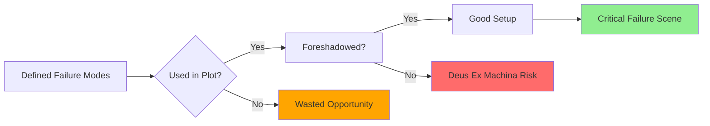

**Undocumented Failures**:
- Chapter __: System fails in way not in database
  - Failure type: [Description]
  - Cause: [What triggers it]
  - Effect: [What happens]
  - **Action**: [ ] Add to database [ ] Remove from story

**Missing Failure Opportunities**:
- Defined failure mode [X] never occurs in story
  - **Potential use**: Chapter __ (where it could create tension)
  - **Action**: [ ] Add failure scene [ ] Remove from database

**REVISION ACTIONS**:
- [ ] Foreshadow critical failure:
   - Chapter __ (early): [Mention weakness/concern]
   - Chapter __ (middle): [Non-critical failure as warning]
   - Chapter __ (climax): [Critical failure occurs]
- [ ] Add recovery mechanism:
   - Failure: [Which one]
   - Recovery: [How characters fix it]
   - Time required: [Duration]
   - Add to database and show in chapter: __
- [ ] Remove unused failure mode:
   - Mode: [Which one]
   - Reason: [Doesn't serve plot]
   - Delete from database
- [ ] Add new failure mode from story:
   - Mode: [Description]
   - Document in database
   - Foreshadow earlier in chapter: __

---

## SECTION 5: INTEGRATION & DEPENDENCIES AUDIT

### 5.1 System Relationship Verification

**Database Claims**:
- **Required Components**: [List from database]
- **Compatible Systems**: [List from database]
- **Conflicting Systems**: [List from database]

**Dependency Validation Matrix**:
| Dependent System | Required Component | Database Claims | Story Shows | Match? | Issue |
|------------------|-------------------|-----------------|-------------|--------|-------|
| [SYSTEM-XXX] | [SYSTEM-YYY] | [Dependency type] | Ch __ [Evidence] | [Y/N] | [Details] |

**Dependency Graph Analysis**:
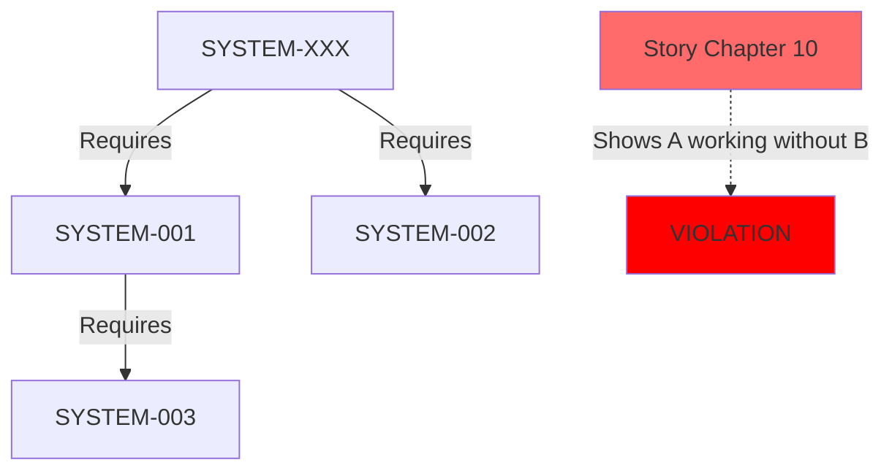

**Circular Dependency Check**:
- [ ] No circular dependencies found
- [ ] Circular dependency detected: [A]→[B]→[C]→[A]
  - **Problem**: Impossible bootstrap
  - **Fix needed**: [Break cycle at ___]

**Compatibility Verification**:
| System A | System B | Database Says | Chapter | Story Shows | Match? | Issue |
|----------|----------|---------------|---------|-------------|--------|-------|
| [XXX] | [YYY] | [Compatible/Synergy] | [#] | [Observed] | [Y/N] | [Details] |

**Conflict Verification**:
| System A | System B | Database Says | Chapter | Conflict Shown? | Match? | Issue |
|----------|----------|---------------|---------|-----------------|--------|-------|
| [XXX] | [YYY] | [Nature of conflict] | [#] | [Y/N - Details] | [Y/N] | [Notes] |

**Critical Issues**:
1. **Missing Dependency**:
   - System works in chapter __ without required component
   - Database says requires: [Component]
   - Story shows: [Working independently]

2. **Undeclared Dependency**:
   - Chapter __: System uses [Component] not in database
   - Integration appears as: [Description]

3. **Ignored Conflict**:
   - Database: [System-A] conflicts with [System-B]
   - Chapter __: Both used together without issue
   - Expected conflict: [What should happen]

**REVISION ACTIONS**:
- [ ] Add missing component to scene:
   - Chapter __: Show [Component] present and active
   - Explain relationship: [How it enables main system]
- [ ] Document new dependency:
   - Add to both system databases: [SYSTEM-XXX] and [SYSTEM-YYY]
   - Type: [Required/Uses/Enhances]
- [ ] Remove invalid dependency:
   - Delete from database: [Which dependency]
   - Reason: [Story proves it's unnecessary]
- [ ] Add conflict scene:
   - Chapter __: Show interference between [A] and [B]
   - Manifestation: [How conflict appears]
   - Resolution: [How characters deal with it]
- [ ] Remove conflict claim:
   - Update databases for [System-A] and [System-B]
   - Reason: [Story requires compatibility]

---

### 5.2 Component Architecture Audit

**Declared Components** (from Required Components section):
1. [Component-1]: [Relationship description]
2. [Component-2]: [Relationship description]

**Component Usage Verification**:
| Component | Used in Story? | Chapter | Function Shown | Necessary? | Action |
|-----------|----------------|---------|----------------|------------|--------|
| [Name] | [Y/N] | [#] | [Description] | [Y/N] | [Keep/Remove] |

**Missing Components Detection**:
- System does [X] in chapter __ but no component enables [X]
  - **Required component**: [Description of what's needed]
  - **Action**: [ ] Add to database [ ] Remove capability from story

**REVISION ACTIONS**:
- [ ] Remove ghost component:
   - Component: [Name]
   - Delete from database
- [ ] Add missing component:
   - Component: [Name and function]
   - Add to database
   - Mention in chapter: __ (establish its existence)
- [ ] Show component in action:
   - Chapter __: [Scene demonstrating component's role]

---

## SECTION 6: DEVELOPMENT & HISTORY AUDIT

### 6.1 Timeline Coherence

**Database Entry**:
- **Creation Timeline**: [From database]
- **Evolution**: [From database]
- **Current Version**: [From database]

**Timeline Validation**:
| Event | Database Date | Story Reference | Match? | Issue |
|-------|---------------|-----------------|--------|-------|
| [Development milestone] | [Date] | Ch __ [Reference] | [Y/N] | [Details] |

**Prerequisite Technology Check**:
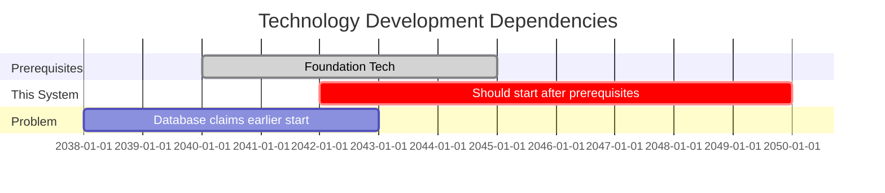

**Anachronism Detection**:
- [ ] System appears before required technology exists
  - Required: [Technology X] (available: [Date])
  - This system: (appears: [Date])
  - **Problem**: [X years too early]

**Development Timeframe Realism**:
| Stage | Database Duration | Realistic Duration | Match? | Issue |
|-------|-------------------|-------------------|--------|-------|
| Research to Prototype | [Time] | [Expected: X years] | [Y/N] | [Details] |
| Prototype to Deployment | [Time] | [Expected: X years] | [Y/N] | [Details] |

**REVISION ACTIONS**:
- [ ] Adjust development dates:
   - New timeline: [Dates]
   - Update database
   - Revise story references in chapters: [List]
- [ ] Add prerequisite technology:
   - Technology: [Name] ([[SYSTEM-new]])
   - Establish in timeline before main system
   - Reference in chapter: __
- [ ] Extend development time:
   - Add intermediate stages: [Description]
   - Show longer process in flashback/exposition
- [ ] Accept acceleration:
   - Add justification: [Breakthrough/Crisis/Resource investment]
   - Explain in chapter: __

---

### 6.2 Evolution & Versioning Coherence

**Database Claims**:
- **Evolution**: [Major upgrades from database]
- **Current Version**: [From database]

**Version Consistency Check**:
| Chapter | Version Used | Capabilities Shown | Matches Database? | Issue |
|---------|--------------|-------------------|-------------------|-------|
| [#] | [Explicit/Implied] | [What it can do] | [Y/N] | [Details] |

**Upgrade Continuity**:
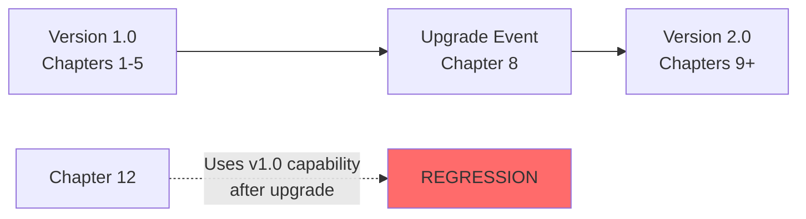

**Problems Found**:
1. **Version Confusion**:
   - Chapter __: Uses old capability after upgrade
   - Should be: [New behavior]
   - Currently: [Old behavior]

2. **Unexplained Upgrade**:
   - System suddenly has new capability in chapter __
   - No upgrade event shown
   - Database doesn't document when/how

**REVISION ACTIONS**:
- [ ] Add upgrade scene:
   - Chapter __: Show upgrade process
   - New capabilities: [List]
   - Update database with version history
- [ ] Remove capability regression:
   - Chapter __: Update to version 2.0 behavior
- [ ] Document version in database:
   - Version number: [X.Y]
   - Changes from previous: [List]
   - Story introduction: Chapter __
- [ ] Clarify which version when:
   - Add timeline note: "Upgraded between chapters __ and __"

---

## SECTION 7: USAGE IN STORY AUDIT

### 7.1 Introduction & Demonstration Coherence

**Database Entry**:
- **First Introduction**: [From database]
- **Key Demonstrations**: [List from database]

**Actual Story Analysis**:
| Database Claims | Story Reality | Match? | Issue |
|-----------------|---------------|--------|-------|
| First intro: Ch __ | Actually first mentioned: Ch __ | [Y/N] | [Details] |
| First intro: Ch __ | But referenced earlier in: Ch __ | [N] | [Retroactive reference] |

**Introduction Quality Check**:
- [ ] First mention is clear and memorable
- [ ] Reader understands basic function
- [ ] Context makes sense for introduction
- [ ] Foreshadowing appropriate (not too much/little)

**Demonstration Verification**:
| Key Demo | Database Says | Chapter | Actually Demonstrated? | Impact Shown? | Quality |
|----------|---------------|---------|----------------------|---------------|---------|
| [Demo 1] | Ch __ | [Actual] | [Y/N] | [Y/N] | [Rating] |
| [Demo 2] | Ch __ | [Actual] | [Y/N] | [Y/N] | [Rating] |

**Demonstration Progression**:
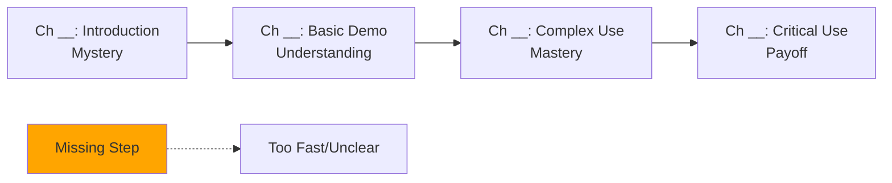

**Assessment**: [Smooth / Has Gaps / Too Rushed / Too Slow]

**REVISION ACTIONS**:
- [ ] Update first introduction location:
   - Database: Change to Chapter __
   - Reason: [Actual first appearance]
- [ ] Add earlier foreshadowing:
   - Chapter __: [Subtle mention/hint]
   - Prepares reader for chapter __ introduction
- [ ] Add demonstration scene:
   - Chapter __: Show [specific capability]
   - Purpose: [Fill gap in understanding]
   - Significance: [Why important for plot]
- [ ] Remove demonstration:
   - Chapter __: [Scene to cut]
   - Reason: [Redundant/Irrelevant]
- [ ] Enhance existing demonstration:
   - Chapter __: [Current scene]
   - Add: [Specific details/stakes/character reaction]

---

### 7.2 Character Interaction Coherence

**Database Entry**:
- **Character Interactions**: [List from database]

**Character Relationship Verification**:
| Character | Database Says | Chapter | Story Shows | Match? | Issue |
|-----------|---------------|---------|-------------|--------|-------|
| [[CHAR-xxx]] | [Relationship] | [#] | [Actual interaction] | [Y/N] | [Details] |

**Expertise Consistency**:
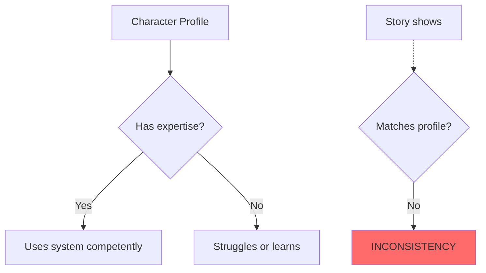

**Problems Found**:
1. **Unexplained Competence**:
   - Character: [[CHAR-xxx]]
   - Chapter __: Uses system expertly
   - Character database: No relevant expertise
   - **Issue**: [Breaks believability]

2. **Missing Interaction**:
   - Database claims: [[CHAR-xxx]] is primary user
   - Story reality: Character never uses it
   - **Issue**: [Wasted setup]

3. **Contradictory Relationship**:
   - Database: Character distrusts system
   - Chapter __: Uses it without hesitation
   - **Issue**: [Character inconsistency]

**REVISION ACTIONS**:
- [ ] Add expertise to character:
   - Character: [[CHAR-xxx]]
   - Expertise: [Type and level]
   - Update character database
   - Show acquisition in chapter: __ (training/experience)
- [ ] Add learning curve:
   - Chapter __: Character struggles with system
   - Chapter __: Improves through practice
   - Chapter __: Achieves mastery
- [ ] Add usage scene:
   - Character: [[CHAR-xxx]]
   - Chapter __: [Scene showing them use system]
   - Purpose: [Fulfill database promise]
- [ ] Update database:
   - Change primary user from [A] to [B]
   - Reason: [Story evolved differently]
- [ ] Add character conflict with system:
   - Chapter __: [Scene showing distrust/difficulty]
   - Resolve: [How/when they overcome it]

---

### 7.3 Plot Integration Validation

**Database Entry**:
- **Plot Integration**:
  - Conflict Generation: [From database]
  - Solution Enabling: [From database]

**Conflict Analysis**:
| Database Claim | Chapter | Actually Creates Conflict? | Type | Quality |
|----------------|---------|---------------------------|------|---------|
| [Conflict type] | [#] | [Y/N] | [Interpersonal/Technical/Moral] | [Rating] |

**Solution Analysis**:
| Database Claim | Chapter | Actually Enables Solution? | Too Convenient? | Quality |
|----------------|---------|---------------------------|-----------------|---------|
| [Solution type] | [#] | [Y/N] | [Y/N] | [Rating] |

**Narrative Function Assessment**:
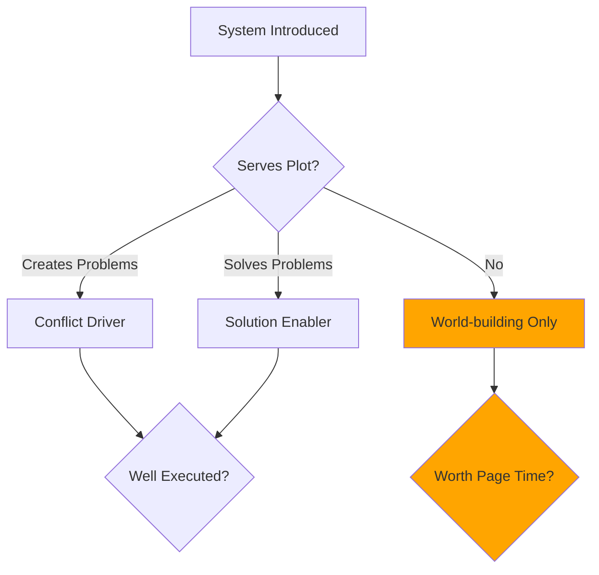

**Critical Issues**:
1. **Deus Ex Machina Risk**:
   - System solves problem in chapter __ too easily
   - No foreshadowing of capability
   - No cost or limitation shown
   - **Impact**: [Deflates tension]

2. **Unfulfilled Promise**:
   - System creates conflict in chapter __
   - Resolution never addressed
   - **Impact**: [Loose thread]

