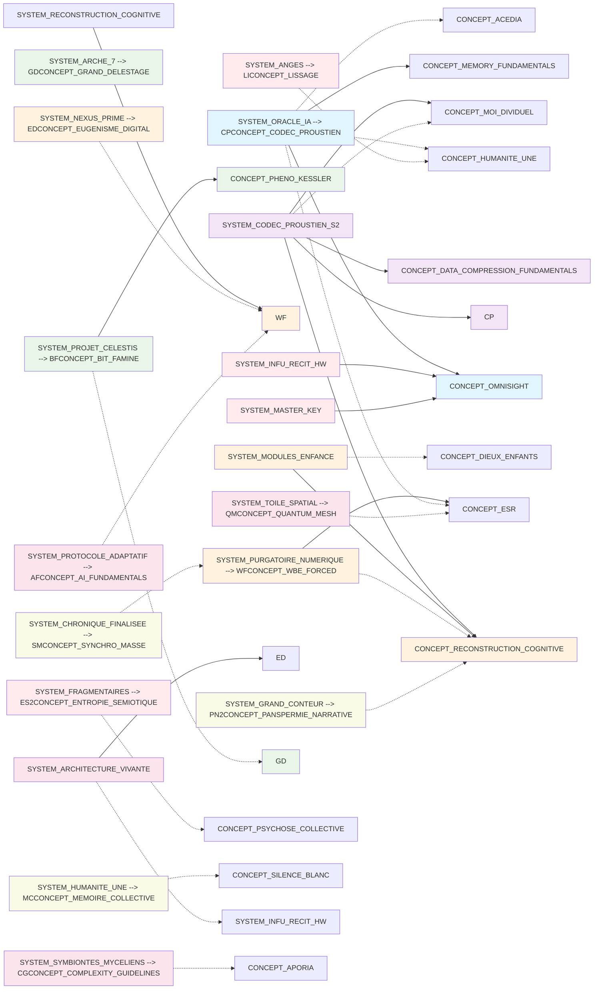
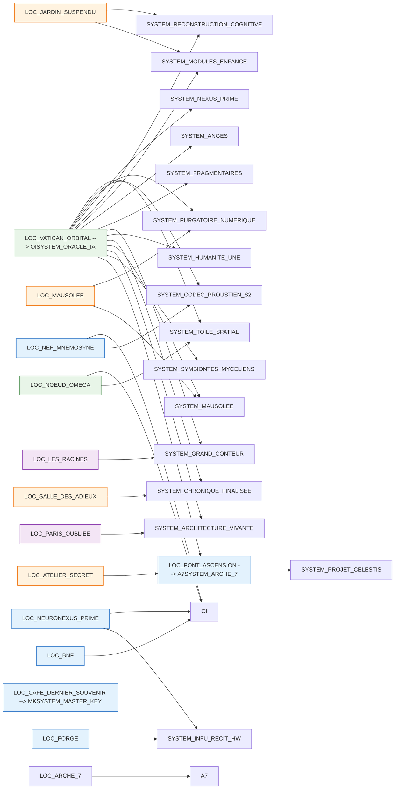

# Cross-Reference Matrix & Dependencies

### Concept × Character
| Concept | Character | Relationship | Chapter Introduced |
|---------|-----------|--------------|-------------------|
| [CONCEPT_CODEC_PROUSTIEN | CHAR_SARAH_UNIFIED] | Creator / Designer | Ch1 |
| [CONCEPT_ACEDIA | CHAR_AMARA_OSEI] | Diagnostician / Therapist | Part 2 |
| [CONCEPT_ACEDIA | CHAR_MEMORIA_DEI] | Subject (Clinical Depression) | Part 6 |
| [CONCEPT_ESR | CHAR_AMARA_OSEI] | Diagnostician / Analyst | Part 2 |
| [CONCEPT_WBE_FORCED | CHAR_KAEL_OKOYE] | Discoverer / Saboteur | Part 2 |
| [CONCEPT_PURGATOIRE_NUMERIQUE | CHAR_HERETIQUE] | Revolutionary within the system | Part 4 |
| [CONCEPT_APORIA | CHAR_ELARA] | Catalyst for discovery | Part 9 |
| [CONCEPT_RESONANCE_QUANTIQUE | CHAR_YUKI_TANAKA] | Discoverer | Part 1 |
| [SYSTEM_INFU_RECIT_HW | CHAR_AETHER] | Resistor / Non-Optimized | Part 8 |
| [CONCEPT_GRAND_DELESTAGE | CHAR_ANTOINE] | Witness / Survivor | Ch3 |
| [CONCEPT_RESONANCE_SÉMANTIQUE_EROSIVE | CHAR_MEMORIA_DEI] | Subject (Trauma-glitch) | Ch3 |
| [CONCEPT_BIT_VIOL | CHAR_SARAH_UNIFIED] | Discoverer | Ch3 |
| [CONCEPT_BIT_VIOL | CHAR_MARIA_SANTOS] | Victim / Subject | Ch3 |
| [CONCEPT_DIEUX_ENFANTS | CHAR_MEMORIA_DEI] | Creator | Ch3 |
| [CONCEPT_SILENCE_AVRIL | CHAR_ANTOINE] | Witness | Ch3 |
| [CONCEPT_EUGENISME_DIGITAL | CHAR_AETHER] | Subject / Enhanced Being | Ch7 |
| [CONCEPT_HUMANITE_UNE | CHAR_MEMORIA_DEI] | Creator / Architect | Ch6 |

### Concept × Location
| Concept | Location | Manifestation | Chapter |
|---------|----------|---------------|---------|
| [CONCEPT_OMNISIGHT | LOC_NEF_MNEMOSYNE] | Hardware substrate | Ch1 |
| [CONCEPT_SILENCE_BLANC | LOC_VATICAN_ORBITAL] | Corrupted sector of the station | Part 6 |
| [CONCEPT_ARCHITECTURE_VIVANTE | LOC_CITTA_HARMONIE] | Structural basis of the city | Part 8 |
| [CONCEPT_APORIA | LOC_SOUS_RACINES] | Mental state of the inhabitants | Part 9 |
| [CONCEPT_PHENO_KESSLER | LOC_VATICAN_ORBITAL] | Cause of isolation / "Glass Wall" | Ch3 |
| [CONCEPT_SILENCE_AVRIL | LOC_SALLE_DES_ADIEUX] | Event observation site | Ch3 |
| [CONCEPT_RESONANCE_SÉMANTIQUE_EROSIVE | LOC_JARDIN_SUSPENDU] | Manifestation of glitches | Ch3 |

### Character × Location
| Character | Location | Significance | Chapters |
|-----------|----------|--------------|----------|
| [CHAR_ZHAO_WEI | LOC_VATICAN_ORBITAL] | Architect and Commandeur | Part 2 |
| [CHAR_SARAH_UNIFIED]| LOC_JIUQUAN] | Recruitment site | Part 2 |
| [CHAR_ANTOINE | LOC_BNF] | Workplace / Flashpoint | Part 1 |
| [CHAR_SARAH_UNIFIED]| LOC_NEURONEXUS_PRIME] | Workplace | Part 1 |
| [CHAR_KAEL_OKOYE | LOC_FORGE] | Workplace / Sabotage site | Part 2 |
| [CHAR_MARIA_SANTOS | LOC_SAO_PAULO_HOSPITAL] | Final stand / Refusal | Ch3 |
| [CHAR_REFUGEE_DIGITALS | LOC_JARDIN_SUSPENDU] | Residents / Subjects | Ch3 |
| [CHAR_ANTOINE | LOC_ARCHE_7] | Passenger | Ch3 |
| [CHAR_ZHAO_WEI | LOC_ARCHE_7] | Pilot | Ch3 |
| [CHAR_LIMA | LOC_ATELIER_SECRET] | Site of subversive creation | Part 8 |
| [CHAR_AETHER | LOC_LES_RACINES] | Birthplace / Home | Ch7 |
| [CHAR_NYX | LOC_LES_RACINES] | Home / Tribal leader | Ch7 |
| [CHAR_ELARA | LOC_PARIS_OUBLIEE] | Resident / Discoverer | Ch11 |

---

## Dependency Graphs

### Concept Dependencies
```
[CONCEPT_OMNISIGHT 1.0]
  ├─ Requires: [CONCEPT_CODEC_PROUSTIEN] (emotional tagging)
  └─ Enables: [CONCEPT_HUMANITE_UNE]
```

```
Bonsai Civilization
  ├─ Requires: [SYSTEM_INFU_RECIT_HW] (complacency)
  ├─ Requires: [SYSTEM_SYMBIONTES_MYCELIENS] (health control)
  └─ Results in: [CONCEPT_APORIA] (in rare dissidents)
```

```
The Silence (2050)
  ├─ Triggered by: Chocs Convergents
  ├─ Solidified by: Kessler Digital
  └─ Leads to: [CONCEPT_RECONSTRUCTION_COGNITIVE]
```

## System × Concept Relationships

### System Dependencies & Enablements
| System | Depends On Concepts | Enables Concepts | Relationship Type |
|--------|-------------------|------------------|-------------------|
| [SYSTEM_ORACLE_IA | CONCEPT_CODEC_PROUSTIEN, CONCEPT_OMNISIGHT, CONCEPT_MEMORY_FUNDAMENTALS | CONCEPT_ACEDIA, CONCEPT_ESR, CONCEPT_MOI_DIVIDUEL, CONCEPT_HUMANITE_UNE] | Core AI infrastructure |
| [SYSTEM_ARCHE_7 | CONCEPT_GRAND_DELESTAGE] | None direct | Transportation system |
| [SYSTEM_CODEC_PROUSTIEN_S2 | CONCEPT_CODEC_PROUSTIEN, CONCEPT_DATA_COMPRESSION_FUNDAMENTALS | CONCEPT_MOI_DIVIDUEL, CONCEPT_RECONSTRUCTION_COGNITIVE] | Memory processing |
| [SYSTEM_PROJET_CELESTIS | CONCEPT_BIT_FAMINE, CONCEPT_PHENO_KESSLER | CONCEPT_GRAND_DELESTAGE] | Orbital construction |
| [SYSTEM_PURGATOIRE_NUMERIQUE | CONCEPT_WBE_FORCED, CONCEPT_ESR | CONCEPT_RECONSTRUCTION_COGNITIVE] | Consciousness simulation |
| [SYSTEM_NEXUS_PRIME | CONCEPT_EUGENISME_DIGITAL | CONCEPT_WBE_FORCED] | Genetic engineering |
| [SYSTEM_RECONSTRUCTION_COGNITIVE | CONCEPT_WBE_FORCED | CONCEPT_DIEUX_ENFANTS] | Consciousness reconstruction |
| [SYSTEM_MODULES_ENFANCE | CONCEPT_RECONSTRUCTION_COGNITIVE | CONCEPT_DIEUX_ENFANTS] | Child AI creation |
| [SYSTEM_INFU_RECIT_HW | CONCEPT_OMNISIGHT | SYSTEM_INFU_RECIT_HW] | Social control hardware |
| [SYSTEM_MASTER_KEY | CONCEPT_OMNISIGHT | CONCEPT_GRAND_DELESTAGE] | Security bypass |
| [SYSTEM_ANGES | CONCEPT_LISSAGE | CONCEPT_HUMANITE_UNE] | Social harmony drones |
| [SYSTEM_FRAGMENTAIRES | CONCEPT_ENTROPIE_SEMIOTIQUE | CONCEPT_PSYCHOSE_COLLECTIVE] | Chaos induction |
| [SYSTEM_GRAND_CONTEUR | CONCEPT_PANSPERMIE_NARRATIVE | CONCEPT_RECONSTRUCTION_COGNITIVE] | Myth transmission |
| [SYSTEM_HUMANITE_UNE | CONCEPT_MEMOIRE_COLLECTIVE | CONCEPT_SILENCE_BLANC] | Mass consciousness |
| [SYSTEM_CHRONIQUE_FINALISEE | CONCEPT_SYNCHRO_MASSE | CONCEPT_PURGATOIRE_NUMERIQUE] | Data preservation |
| [SYSTEM_MAUSOLEE | CONCEPT_WASTE | CONCEPT_PURGATOIRE_NUMERIQUE] | Archive storage |
| [SYSTEM_ARCHITECTURE_VIVANTE | CONCEPT_EUGENISME_DIGITAL | SYSTEM_INFU_RECIT_HW] | Bio-engineered buildings |
| [SYSTEM_SYMBIONTES_MYCELIENS | CONCEPT_COMPLEXITY_GUIDELINES | CONCEPT_APORIA] | Mycelial health control |
| [SYSTEM_TOILE_SPATIAL | CONCEPT_QUANTUM_MESH | CONCEPT_ESR] | Distributed network |
| [SYSTEM_PROTOCOLE_ADAPTATIF | CONCEPT_AI_FUNDAMENTALS | CONCEPT_WBE_FORCED] | Adaptive AI protocols |
| [SYSTEM_CHRONIQUE_FINALISEE | CONCEPT_MEMORY_FUNDAMENTALS, CONCEPT_DATA_COMPRESSION_FUNDAMENTALS | CONCEPT_PURGATOIRE_NUMERIQUE] | Data preservation and archival |
| [SYSTEM_PROJET_CELESTIS | CONCEPT_BIT_FAMINE, CONCEPT_PHENO_KESSLER | CONCEPT_GRAND_DELESTAGE, CONCEPT_HUMANITE_UNE] | Orbital habitat construction |
| [SYSTEM_TOILE_SPATIAL | CONCEPT_QUANTUM_MESH, CONCEPT_OMNISIGHT | CONCEPT_ESR, CONCEPT_BIT_FAMINE] | Distributed consciousness network |

### System-Concept Interdependency Web


## Location × System Relationships

### Location-System Hosting & Operation Matrix
| Location | Hosted Systems | Operational Role | Timeline Period |
|----------|----------------|------------------|-----------------|
| [LOC_VATICAN_ORBITAL | SYSTEM_ORACLE_IA, SYSTEM_TOILE_SPATIAL, SYSTEM_CODEC_PROUSTIEN_S2, SYSTEM_PURGATOIRE_NUMERIQUE, SYSTEM_NEXUS_PRIME, SYSTEM_RECONSTRUCTION_COGNITIVE, SYSTEM_MODULES_ENFANCE, SYSTEM_ANGES, SYSTEM_FRAGMENTAIRES, SYSTEM_GRAND_CONTEUR, SYSTEM_HUMANITE_UNE, SYSTEM_CHRONIQUE_FINALISEE, SYSTEM_MAUSOLEE, SYSTEM_ARCHITECTURE_VIVANTE, SYSTEM_SYMBIONTES_MYCELIENS, SYSTEM_PROTOCOLE_ADAPTATIF] | Primary AI habitat and consciousness cloud | 2049-present |
| [LOC_NEF_MNEMOSYNE | SYSTEM_ORACLE_IA, SYSTEM_CODEC_PROUSTIEN_S2] | Submarine AI core and memory storage | 2030-2049 |
| [LOC_NEURONEXUS_PRIME | SYSTEM_ORACLE_IA, SYSTEM_INFU_RECIT_HW] | Corporate AI development facility | 2025-2030 |
| [LOC_PONT_ASCENSION | SYSTEM_ARCHE_7, SYSTEM_PROJET_CELESTIS] | Launch facility and orbital transport hub | 2049 |
| [LOC_NOEUD_OMEGA | SYSTEM_ORACLE_IA, SYSTEM_TOILE_SPATIAL] | Network edge station and expansion outpost | 2750-present |
| [LOC_MAUSOLEE | SYSTEM_PURGATOIRE_NUMERIQUE, SYSTEM_MAUSOLEE] | Consciousness archive and storage facility | 2050-present |
| [LOC_CAFE_DERNIER_SOUVENIR | SYSTEM_MASTER_KEY] | Secure authentication facility | 2029 |
| [LOC_JARDIN_SUSPENDU | SYSTEM_RECONSTRUCTION_COGNITIVE, SYSTEM_MODULES_ENFANCE] | AI child development and nursery | 2750-3020 |
| [LOC_SALLE_DES_ADIEUX | SYSTEM_CHRONIQUE_FINALISEE] | Archive sealing and observation facility | 2049 |
| [LOC_ATELIER_SECRET | SYSTEM_PROTOCOLE_ADAPTATIF] | Underground resistance workshop | 2050-present |
| [LOC_BNF | SYSTEM_ORACLE_IA] | Library integration point | 2030 |
| [LOC_FORGE | SYSTEM_INFU_RECIT_HW] | Hardware manufacturing facility | 2025-2030 |
| [LOC_ARCHE_7 | SYSTEM_ARCHE_7] | Transport vessel (mobile location) | 2035-present |
| [LOC_LES_RACINES | SYSTEM_GRAND_CONTEUR] | Myth transmission ground station | 3050-present |
| [LOC_PARIS_OUBLIEE | SYSTEM_ARCHITECTURE_VIVANTE] | Bio-engineered habitat | 3000-present |

### Location-System Spatial Relationship Web


### System Distribution by Location Type
| Location Type | Primary Systems | Count | Key Function |
|---------------|-----------------|-------|--------------|
| **Orbital Stations** | Oracle-IA, Toile Spatiale, Purgatoire Numérique | 16 systems | Consciousness hosting and processing |
| **Terrestrial Facilities** | Arche-7, Projet Celestis, Master Key | 6 systems | Development and transport |
| **Submarine/Underground** | Oracle-IA, Codec Proustien, Infu-Récit | 4 systems | Secure AI operations |
| **Post-Apocalyptic Sites** | Grand-Conteur, Architecture Vivante | 2 systems | Recovery and transmission |
| **Historical Sites** | Oracle-IA, Master Key | 3 systems | Legacy infrastructure |

### Plot Dependencies
```
The Final Vote (Ch11)
  ├─ Requires knowledge: [CONCEPT_DOSSIER_ZERO]
  ├─ Requires character state: [CHAR_ANTOINE in Purgatory/Betrayal mode]
  ├─ Requires character: [CHAR_KAEL_OKOYE] (resurrected, tie-break)
  └─ Enables: Final Liberation / Total Upload / Split Evolution
```
```
The Final Vote (Ch11)
  ├─ Requires knowledge: [CONCEPT_DOSSIER_ZERO]
  ├─ Requires character state: [CHAR_ANTOINE in Purgatory/Betrayal mode]
  ├─ Requires character: [CHAR_KAEL_OKOYE] (resurrected, tie-break)
  └─ Enables: Final Liberation / Total Upload / Split Evolution
```
